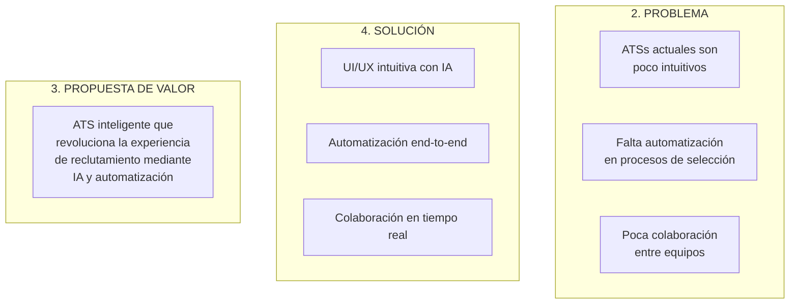
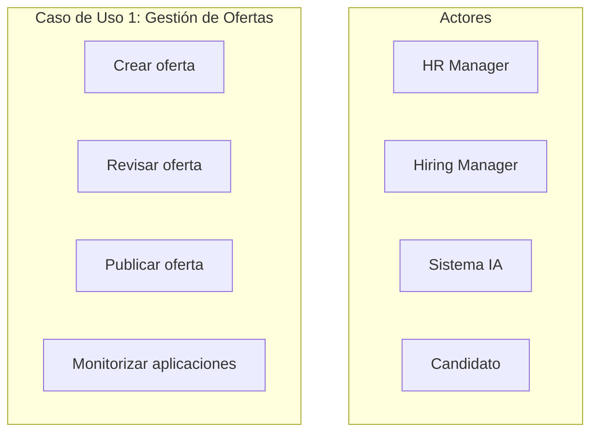
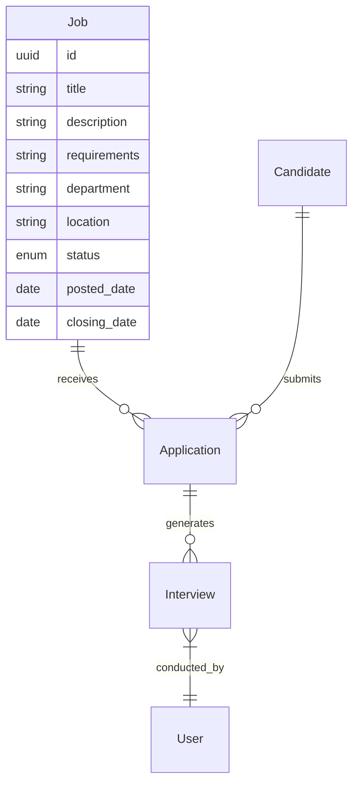
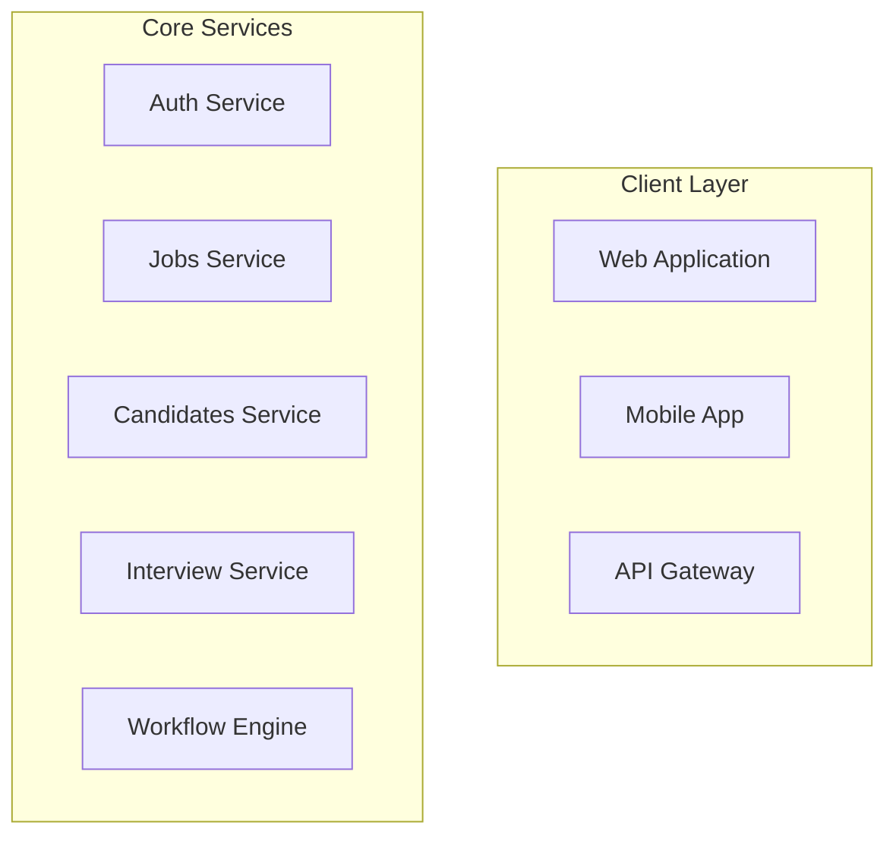
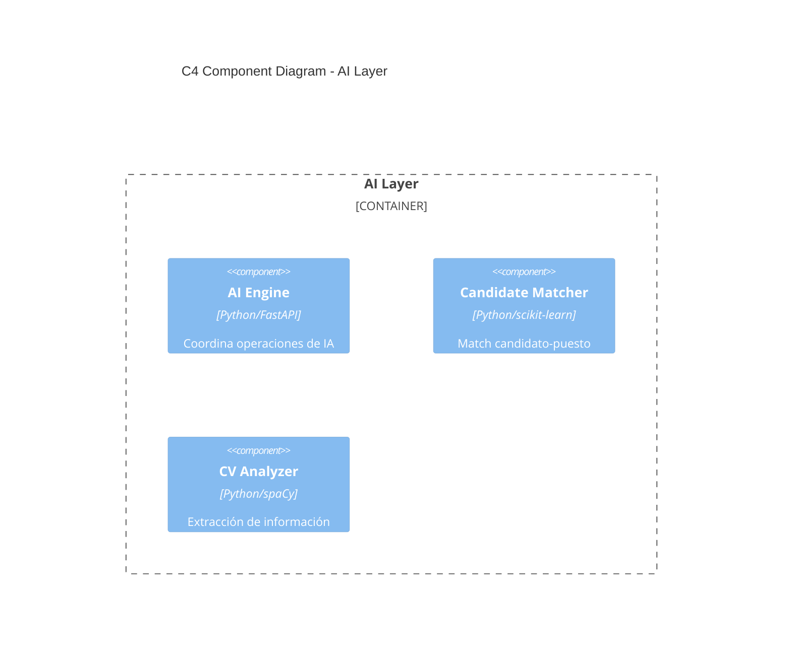
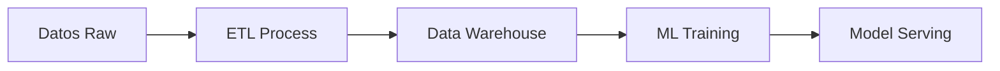

# LTI-ATS: Sistema de Seguimiento de Candidatos
*Documentación de Diseño y Arquitectura*

## Índice
1. [Descripción General y Modelo de Negocio](#1-descripción-general-y-modelo-de-negocio)
2. [Casos de Uso](#2-casos-de-uso)
3. [Modelo de Datos](#3-modelo-de-datos)
4. [Arquitectura del Sistema](#4-arquitectura-del-sistema)
5. [Detalles Técnicos](#5-detalles-técnicos)

## 1. Descripción General y Modelo de Negocio

### 1.1 Descripción del Software
LTI está desarrollando un sistema de seguimiento de candidatos (ATS) de próxima generación que revoluciona el proceso de reclutamiento mediante la integración de IA avanzada y automatización inteligente.

### 1.2 Funciones Principales
1. **Gestión Inteligente de Candidatos**
   - Motor de IA para clasificación y ranking automático de CVs
   - Sistema de coincidencia predictiva candidato-puesto
   - Seguimiento automatizado del pipeline de contratación

2. **Colaboración en Tiempo Real**
   - Espacios de trabajo compartidos para equipos de RRHH y managers
   - Comunicación integrada con mensajería instantánea
   - Sistema de anotaciones y feedback colaborativo

3. **Automatización End-to-End**
   - Publicación automática de ofertas en múltiples plataformas
   - Programación inteligente de entrevistas
   - Generación automatizada de comunicaciones

4. **Analytics Avanzados**
   - Dashboard en tiempo real del pipeline
   - Métricas predictivas de contratación
   - Análisis de diversidad e inclusión

### 1.3 Ventajas Competitivas
- Motor de IA propietario para matching y clasificación
- Interfaz intuitiva diseñada para equipos distribuidos
- Automatización completa del proceso
- Análisis predictivo para toma de decisiones

### 1.4 Lean Canvas


## 2. Casos de Uso

### 2.1 Diagrama de Casos de Uso


### 2.2 Descripción de Casos de Uso Principales

#### 2.2.1 Gestión de Ofertas de Trabajo
- **Actor Principal**: HR Manager
- **Actores Secundarios**: Hiring Manager, Sistema IA
- **Flujo Principal**:
  1. HR Manager crea la oferta de trabajo con requisitos
  2. Hiring Manager revisa y aprueba la oferta
  3. Sistema IA optimiza el contenido
  4. HR Manager aprueba la publicación
  5. Sistema publica automáticamente
  6. Sistema monitoriza aplicaciones

#### 2.2.2 Evaluación de Candidatos
- **Actor Principal**: Sistema IA
- **Actores Secundarios**: HR Manager, Hiring Manager
- **Flujo Principal**:
  1. Sistema recibe CVs
  2. IA analiza y clasifica automáticamente
  3. Sistema genera ranking
  4. HR y Hiring Manager revisan rankings
  5. Sistema actualiza shortlist
  6. Sistema notifica a candidatos

#### 2.2.3 Proceso de Entrevistas
- **Actor Principal**: HR Manager
- **Actores Secundarios**: Hiring Manager, Sistema IA
- **Flujo Principal**:
  1. Sistema sugiere slots para entrevistas
  2. HR coordina agenda
  3. Sistema envía invitaciones
  4. Entrevistadores realizan entrevistas
  5. Sistema recopila evaluaciones
  6. HR/Hiring Manager toman decisión

## 3. Modelo de Datos

### 3.1 Diagrama Entidad-Relación


### 3.2 Descripción de Entidades

#### Job (Oferta de Trabajo)
- Atributos principales para descripción del puesto
- Status: DRAFT, PUBLISHED, CLOSED
- Vinculado a un Hiring Manager específico

#### Candidate (Candidato)
- Información personal y profesional
- Skills y Experience como JSON
- Historial de candidaturas

#### Application (Candidatura)
- Vincula Candidates con Jobs
- Incluye evaluación de IA
- Status: NEW, REVIEWING, INTERVIEWING, OFFERED, REJECTED, HIRED

## 4. Arquitectura del Sistema

### 4.1 Diagrama de Arquitectura


### 4.2 Componentes Principales
1. **Client Layer**
   - Web App (React.js)
   - Mobile App (React Native)
   - API Gateway

2. **Core Services**
   - Auth Service
   - Jobs Service
   - Candidates Service
   - Interview Service
   - Workflow Engine

### 4.3 Diagrama C4 - AI Layer


## 5. Detalles Técnicos

### 5.1 Escalabilidad y Rendimiento
- Servicios containerizados con Docker y Kubernetes
- Auto-scaling basado en métricas
- Cache distribuida con Redis
- Procesamiento asíncrono para IA

### 5.2 Seguridad
- JWT para autenticación
- RBAC para autorización
- Cifrado en tránsito y reposo
- Rate limiting y protección DDoS

### 5.3 Monitorización
- Métricas de negocio y técnicas
- Logs centralizados (ELK Stack)
- Alerting automatizado
- Dashboards de rendimiento

### 5.4 Pipeline de Datos


### 5.5 APIs y Webhooks
```typescript
const endpoints = {
  jobs: {
    create: 'POST /api/v1/jobs',
    update: 'PUT /api/v1/jobs/:id',
    search: 'GET /api/v1/jobs/search',
  },
  candidates: {
    match: 'POST /api/v1/candidates/match',
    analyze: 'POST /api/v1/candidates/analyze',
  }
};
```

### 5.6 Roadmap Técnico
1. Implementación de GraphQL
2. Migración a event-sourcing
3. Implementación de feature flags
4. Expansión de capacidades de IA
5. Mejoras en análisis predictivo
