# Descripción del software LTI

# LTI (Learning & Talent Intelligence)

## 🚀 Revolucionando la Gestión del Talento con IA, CRM y HRIS  

**LTI (Learning & Talent Intelligence)** es una plataforma integral que combina un **ATS (Applicant Tracking System), CRM y HRIS**, potenciados con **inteligencia artificial** para transformar la gestión del talento en las empresas. No solo optimiza la selección de candidatos externos, sino que también **identifica, desarrolla y retiene talento interno**, reduciendo la fuga de empleados clave y potenciando la movilidad interna.  

---

## 🔹 Valor Añadido y Diferencial  
✅ **Prevención de fuga de talento con IA:** Identificación temprana de empleados en riesgo de renuncia y estrategias de retención personalizadas.  
✅ **Planes de desarrollo impulsados por IA:** Recomendaciones personalizadas de formación, certificaciones y mentorías para fortalecer las habilidades de los empleados.  
✅ **ATS + CRM + HRIS en un solo ecosistema:** Centraliza la gestión del talento interno y externo en una única plataforma con datos unificados.  
✅ **Reclutamiento inteligente y movilidad interna:** La IA no solo sugiere candidatos externos, sino que también recomienda empleados internos aptos para promociones.  
✅ **Automatización y engagement con candidatos:** CRM integrado que mantiene el contacto con talento clave a largo plazo con comunicación personalizada.  

---

## 🔹 Principales Funciones de LTI  

### 📌 Selección y Reclutamiento Inteligente  
- ATS con filtros avanzados de candidatos internos y externos.  
- Algoritmos de IA que predicen la compatibilidad con el puesto.  

### 📌 Gestión de Talento y Desarrollo Profesional  
- Identificación de empleados listos para promociones.  
- Recomendación de planes de desarrollo personalizados.  

### 📌 Prevención de Fuga de Talento  
- Detección de señales de desmotivación y riesgo de salida.  
- Alertas a RRHH con estrategias de retención.  

### 📌 Interacción con Candidatos y Empleados  
- CRM para gestión de relaciones con talento pasivo.  
- Chatbots de IA para responder dudas y automatizar procesos.  

### 📌 Análisis Predictivo y Reportes Estratégicos  
- Análisis en tiempo real de movilidad interna y rotación.  
- Métricas sobre evolución de empleados y tasas de retención.  

---

## 🚀 Ventajas Competitivas de LTI  
🔹 **Reducción de costos de contratación** al priorizar talento interno.  
🔹 **Aumento de la retención** con estrategias de desarrollo personalizadas.  
🔹 **Mejora en la toma de decisiones** con IA que analiza datos en tiempo real.  
🔹 **Mayor engagement con talento** gracias a la automatización y personalización.  

---

## 💡 Conclusión  
**LTI no es solo un ATS, es una plataforma de gestión del talento con visión de futuro.**  
Transforma la forma en que las empresas **atraen, desarrollan y retienen** a sus empleados, creando un ecosistema inteligente que potencia el crecimiento del talento y la competitividad organizacional. 🚀  

---

## Lead Canvas

# Descripción de los 3 casos de uso principales

# Diagrama de Casos de Uso - Learning & Talent Intelligence (LTI)

## Actores del Sistema

### Actores Principales
* **Reclutadores/RRHH**: Personal encargado de gestionar procesos de selección y desarrollo de talento
* **Líderes de Equipo**: Gerentes y supervisores que participan en decisiones de contratación y desarrollo
* **Candidatos Externos**: Postulantes a posiciones en la empresa
* **Empleados Internos**: Personal actual de la empresa, potenciales candidatos a promociones
* **Sistema de IA**: Motor de inteligencia artificial que potencia las funcionalidades clave

### Actores Secundarios
* **Sistema CRM**: Gestiona relaciones con candidatos y empleados
* **Sistema HRIS**: Maneja información de recursos humanos
* **Chatbot de IA**: Automatiza comunicaciones iniciales
* **Sistema de Análisis Predictivo**: Realiza análisis avanzados de datos

## Módulos Funcionales y Casos de Uso

### 1. Reclutamiento Inteligente (ATS)

#### Filtrado Automático de CVs
* **Descripción**: Sistema automatizado que analiza y clasifica currículums según requisitos de la vacante
* **Flujo Principal**:
  1. Sistema recibe CV del candidato
  2. IA analiza contenido y extrae información clave
  3. Sistema compara con requisitos de la vacante
  4. Genera puntuación de compatibilidad
  5. Clasifica al candidato en categorías predefinidas
* **Precondiciones**: CV en formato compatible y requisitos de vacante definidos
* **Prioridad**: Alta

#### Evaluación Predictiva de Candidatos
* **Descripción**: Análisis predictivo de éxito potencial del candidato basado en datos históricos
* **Flujo Principal**:
  1. Sistema recopila datos del candidato
  2. IA compara con perfiles exitosos históricos
  3. Analiza indicadores de desempeño
  4. Genera predicción de ajuste cultural y técnico
  5. Produce reporte de evaluación
* **Precondiciones**: Base de datos de empleados exitosos existente
* **Prioridad**: Alta

#### Automatización de Entrevistas
* **Descripción**: Gestión automatizada de entrevistas iniciales mediante chatbot
* **Flujo Principal**:
  1. Chatbot agenda entrevista inicial
  2. Realiza preguntas predefinidas
  3. Analiza respuestas en tiempo real
  4. Genera reporte de entrevista
  5. Recomienda siguiente paso del proceso
* **Precondiciones**: Banco de preguntas configurado
* **Prioridad**: Media

### 2. Gestión de Talento Interno y Desarrollo

#### Identificación de Empleados para Promoción
* **Descripción**: Sistema que identifica proactivamente empleados listos para ascender
* **Flujo Principal**:
  1. IA analiza histórico de desempeño
  2. Evalúa habilidades y competencias
  3. Compara con requisitos de posiciones superiores
  4. Identifica brechas de conocimiento
  5. Genera alertas de candidatos potenciales
* **Precondiciones**: Perfiles de cargo y evaluaciones de desempeño actualizadas
* **Prioridad**: Alta

#### Recomendación de Planes de Desarrollo
* **Descripción**: Generación de planes personalizados de desarrollo profesional
* **Flujo Principal**:
  1. Sistema analiza perfil actual del empleado
  2. Identifica áreas de mejora
  3. Sugiere actividades de desarrollo
  4. Define timeline de desarrollo
  5. Monitorea progreso
* **Precondiciones**: Catálogo de recursos de desarrollo disponible
* **Prioridad**: Media

### 3. Prevención de Fuga de Talento

#### Detección de Riesgo de Fuga
* **Descripción**: Sistema de alerta temprana para identificar empleados en riesgo de salida
* **Flujo Principal**:
  1. IA monitorea indicadores de comportamiento
  2. Analiza patrones de actividad
  3. Compara con casos históricos
  4. Calcula probabilidad de salida
  5. Genera alertas de riesgo
* **Precondiciones**: Indicadores de riesgo definidos
* **Prioridad**: Alta

### 4. CRM y Engagement

#### Seguimiento de Candidatos
* **Descripción**: Gestión automatizada del pipeline de candidatos y comunicaciones
* **Flujo Principal**:
  1. Sistema registra interacciones con candidatos
  2. Programa seguimientos automáticos
  3. Actualiza estado en el pipeline
  4. Genera recordatorios de acción
  5. Mantiene base de talentos actualizada
* **Precondiciones**: Pipeline de reclutamiento definido
* **Prioridad**: Alta

### 5. Análisis Predictivo y Reportes

#### Análisis de Eficiencia en Contrataciones
* **Descripción**: Evaluación continua de métricas de contratación y ROI
* **Flujo Principal**:
  1. Sistema recopila datos de contrataciones
  2. Analiza tiempo y costo por contratación
  3. Evalúa calidad de contrataciones
  4. Genera reportes de eficiencia
  5. Propone mejoras al proceso
* **Precondiciones**: Métricas de contratación definidas
* **Prioridad**: Media

## Relaciones Clave
* La Detección de Riesgo de Fuga incluye Análisis de Desempeño y Satisfacción
* Las Estrategias de Retención incluyen Optimización de Estrategias de Retención
* La Identificación de Promociones puede extenderse a Planes de Desarrollo

## DIAGRAMAS DE CASO DE USO (PLANUML)

## DIAGRAMA MER (MERMEID)

# 📌 Modelo de Datos - LTI (Learning & Talent Intelligence)

## 📖 Descripción General  
El modelo de datos de LTI está diseñado para **gestionar el reclutamiento, el desarrollo interno y la prevención de fuga de talento**. Se estructura en torno a varias entidades clave que almacenan y procesan la información relevante de candidatos, empleados y procesos de selección.

---

## 📊 **Principales Entidades y Relaciones**
A continuación, se describen las principales entidades del modelo y sus atributos esenciales.

### **1️⃣ Usuarios (usuarios)**
📌 **Descripción:** Almacena información de los diferentes tipos de usuarios (reclutadores, candidatos, empleados, líderes de equipo).  
🔗 **Relaciones:** Se conecta con **perfiles, postulaciones y evaluaciones**.  

**Atributos:**
- `id_usuario` (PK) - Identificador único del usuario.  
- `nombre` - Nombre completo.  
- `email` - Correo electrónico.  
- `tipo_usuario` - Puede ser: **"reclutador", "candidato_externo", "empleado", "líder_equipo"**.  
- `fecha_creacion` - Fecha de registro.  

---

### **2️⃣ Perfiles Profesionales (perfiles_profesionales)**
📌 **Descripción:** Contiene información detallada sobre habilidades, experiencia y competencias.  
🔗 **Relaciones:** Se asocia a **usuarios** y es utilizado en los procesos de evaluación.  

**Atributos:**
- `id_perfil` (PK) - Identificador único del perfil.  
- `id_usuario` (FK) - Usuario asociado.  
- `experiencia_laboral` - Descripción de la experiencia.  
- `habilidades` - Lista de habilidades técnicas y blandas.  
- `educacion` - Formación académica.  
- `certificaciones` - Certificaciones obtenidas.  
- `nivel_experiencia` - Nivel general de experiencia (Junior, Mid, Senior).  

---

### **3️⃣ Procesos de Selección (procesos_seleccion)**
📌 **Descripción:** Representa las vacantes abiertas y los procesos de selección activos.  
🔗 **Relaciones:** Se asocia con **postulaciones, evaluaciones y candidatos**.  

**Atributos:**
- `id_proceso` (PK) - Identificador único del proceso de selección.  
- `titulo_puesto` - Nombre del puesto ofertado.  
- `descripcion` - Descripción del cargo.  
- `requisitos` - Lista de requisitos esenciales.  
- `estado` - Estado actual (**"Abierto", "En revisión", "Cerrado"**).  
- `fecha_inicio` - Fecha de inicio del proceso.  
- `fecha_cierre` - Fecha estimada de cierre.  

---

### **4️⃣ Postulaciones (postulaciones)**
📌 **Descripción:** Registra las postulaciones realizadas por los candidatos externos o empleados internos.  
🔗 **Relaciones:** Se asocia con **procesos de selección y usuarios**.  

**Atributos:**
- `id_postulacion` (PK) - Identificador único de la postulación.  
- `id_usuario` (FK) - Candidato que aplica.  
- `id_proceso` (FK) - Proceso de selección.  
- `fecha_postulacion` - Fecha en la que se realizó la postulación.  
- `estado` - Estado de la postulación (**"En revisión", "Aceptado", "Rechazado"**).  

---

### **5️⃣ Evaluaciones (evaluaciones)**
📌 **Descripción:** Contiene los resultados de las pruebas y entrevistas de los candidatos.  
🔗 **Relaciones:** Se asocia con **usuarios, procesos de selección y el motor de IA**.  

**Atributos:**
- `id_evaluacion` (PK) - Identificador único de la evaluación.  
- `id_usuario` (FK) - Candidato evaluado.  
- `id_proceso` (FK) - Proceso de selección correspondiente.  
- `tipo_evaluacion` - Tipo de evaluación (**"Técnica", "Psicométrica", "Entrevista"**).  
- `puntuacion` - Resultado obtenido en la evaluación.  
- `feedback` - Comentarios sobre el desempeño del candidato.  

---

### **6️⃣ Desarrollo Profesional (desarrollo_profesional)**
📌 **Descripción:** Registra los planes de desarrollo recomendados para empleados internos.  
🔗 **Relaciones:** Se asocia con **usuarios y evaluaciones**.  

**Atributos:**
- `id_plan` (PK) - Identificador único del plan.  
- `id_usuario` (FK) - Empleado asignado al plan.  
- `habilidades_objetivo` - Habilidades que debe mejorar.  
- `curso_recomendado` - Cursos o certificaciones sugeridas.  
- `estado` - Estado del plan (**"Pendiente", "En progreso", "Completado"**).  

---

### **7️⃣ Predicción de Fuga de Talento (fuga_talento)**
📌 **Descripción:** Almacena los análisis predictivos sobre el riesgo de salida de empleados clave.  
🔗 **Relaciones:** Se asocia con **usuarios y el sistema de IA**.  

**Atributos:**
- `id_fuga` (PK) - Identificador único del análisis.  
- `id_usuario` (FK) - Empleado evaluado.  
- `probabilidad_fuga` - Porcentaje estimado de riesgo de fuga.  
- `factores_identificados` - Motivos detectados por el sistema de IA.  
- `recomendaciones` - Acciones sugeridas para retención.  

---

### **8️⃣ CRM - Seguimiento de Candidatos (crm_seguimiento)**
📌 **Descripción:** Permite hacer un seguimiento detallado de las interacciones con candidatos y empleados internos.  
🔗 **Relaciones:** Se asocia con **usuarios y procesos de selección**.  

**Atributos:**
- `id_seguimiento` (PK) - Identificador único del registro de seguimiento.  
- `id_usuario` (FK) - Candidato o empleado seguido.  
- `ultima_interaccion` - Fecha de la última conversación.  
- `tipo_interaccion` - Canal de comunicación (**"Email", "Llamada", "Entrevista"**).  
- `notas` - Comentarios o notas relevantes.  

---

## 📌 📢 **Otras Entidades Importantes**
Además de las entidades principales, el sistema puede incluir las siguientes para mayor funcionalidad:  

🔹 **Notificaciones (notificaciones)**: Para gestionar alertas de entrevistas, resultados de evaluación, etc.  
🔹 **Historial de Promociones (historial_promociones)**: Para rastrear movimientos internos en la empresa.  
🔹 **Habilidades y Competencias (habilidades_competencias)**: Para estandarizar las habilidades en perfiles y planes de desarrollo.  
🔹 **Análisis Predictivo (analisis_predictivo)**: Para evaluar tendencias en reclutamiento y retención.  

---

## 🎯 **Conclusión**
Este modelo de datos proporciona una **estructura sólida y escalable** para gestionar el talento en una empresa, permitiendo una integración fluida con **IA, CRM y HRIS**. ¡Optimiza el reclutamiento, el desarrollo interno y previene la fuga de talento! 🚀  

## 📌 Diagrama ER en merdmeid

## DISEÑO 

# 🌟 Arquitectura de LTI (Learning & Talent Intelligence) 🌟

## 📌 Explicación de la Arquitectura
El sistema sigue un **modelo de arquitectura en la nube basado en microservicios** con **IA integrada**. Se compone de los siguientes elementos clave:  

### **1️⃣ Capas de la Arquitectura**
### 🔹 Capa de Presentación (Frontend)  
- Aplicaciones web y móviles que interactúan con los usuarios.  
- Uso de **React.js / Next.js** para la web y **Flutter** para móviles.  
- Comunicación vía **API Gateway**.  

### 🔹 Capa de Aplicación (Backend)  
- Servicios organizados en **microservicios** para cada funcionalidad.  
- Uso de **Node.js (NestJS) / Spring Boot (Java) / Python (FastAPI)**.  
- Implementación de colas con **Kafka / RabbitMQ** para procesamiento asíncrono.  

### 🔹 Capa de Datos  
- **Base de datos relacional (PostgreSQL / Oracle)** para datos estructurados.  
- **Base de datos NoSQL (MongoDB / Redis)** para almacenamiento de datos flexibles y caché.  
- **Data Lake en AWS S3 o Google Cloud Storage** para datos históricos y analítica.  

### 🔹 Capa de Inteligencia Artificial  
- **Motor de IA (Machine Learning con TensorFlow / PyTorch / OpenAI)**.  
- Modelos para evaluación de candidatos, predicción de fuga de talento y sugerencia de planes de desarrollo.  
- Desplegado en **servicios serverless como AWS Lambda o Kubernetes (K8s)**.  

### 🔹 Capa de Integración  
- **API Gateway** como **Kong / Apigee** para administrar las peticiones de los clientes.  
- **Service Mesh (Istio / Linkerd)** para gestionar la comunicación entre microservicios.  
- Integración con **CRM (HubSpot / Salesforce) y HRIS (Workday / SAP SuccessFactors)**.  

---

## 📌 Diagrama de Arquitectura en Mermaid

```mermaid
flowchart TD

subgraph "Frontend"
    Web["Web App (React/Next.js)"]
    Mobile["Mobile App (Flutter)"]
end

subgraph "API Gateway"
    Gateway["API Gateway (Kong / Apigee)"]
end

subgraph "Backend Microservices"
    Auth["🔐 Auth Service"]
    ATS["📝 ATS Service"]
    CRM["📞 CRM Service"]
    HRIS["🏢 HRIS Service"]
    IA["🤖 AI Engine"]
    Analytics["📊 Analytics Service"]
    Notification["📨 Notification Service"]
end

subgraph "Databases & Storage"
    PostgreSQL["PostgreSQL - Relational DB"]
    MongoDB["MongoDB - NoSQL"]
    Redis["Redis - Cache"]
    S3["Data Lake (AWS S3)"]
end

subgraph "AI & ML Services"
    MLModel["🤖 ML Model (Talent Prediction)"]
    Chatbot["💬 AI Chatbot"]
    FugaTalent["📉 Fuga de Talento Predictor"]
    Desarrollo["📈 Desarrollo Profesional Recommender"]
end

subgraph "External Integrations"
    CRMExt["CRM: HubSpot/Salesforce"]
    HRISExt["HRIS: Workday/SAP"]
end

Web -->|REST API / GraphQL| Gateway
Mobile -->|REST API / GraphQL| Gateway
Gateway -->|Routes Requests| Auth
Gateway -->|Routes Requests| ATS
Gateway -->|Routes Requests| CRM
Gateway -->|Routes Requests| HRIS
Gateway -->|Routes Requests| IA
Gateway -->|Routes Requests| Analytics
Gateway -->|Routes Requests| Notification

ATS -->|Data Storage| PostgreSQL
CRM -->|Data Storage| MongoDB
HRIS -->|Data Storage| PostgreSQL
IA -->|Data Processing| MLModel
MLModel -->|Stores Results| S3

Analytics -->|Reads Data| PostgreSQL
Analytics -->|Reads Data| MongoDB
Analytics -->|Reads Data| Redis
Analytics -->|Stores Processed Data| S3

IA -->|Uses Model| FugaTalent
IA -->|Uses Model| Desarrollo
Chatbot -->|Interacts with Users| Web
Chatbot -->|Interacts with Users| Mobile

CRM -->|Syncs Data| CRMExt
HRIS -->|Syncs Data| HRISExt

Notification -->|Sends Notifications| Web
Notification -->|Sends Notifications| Mobile
Notification -->|Sends Emails| Email["📧 Email Service"]
```

---

## 📌 Beneficios de Esta Arquitectura

### ✅ Escalabilidad con Kubernetes y microservicios.
### ✅ Alto rendimiento con almacenamiento en caché (Redis) y procesamiento asíncrono (Kafka).
### ✅ Integración con sistemas externos (CRM & HRIS).
### ✅ Predicción avanzada con modelos de Machine Learning para talento.
### ✅ Automatización de comunicación con Chatbots y Notificaciones.

## DIAGRAMA C4

# 📌 Diagrama C4 - LTI (Learning & Talent Intelligence)

## 🏗️ **Descripción General**
Este diagrama representa la arquitectura de **LTI (Learning & Talent Intelligence)** utilizando el **modelo C4**, desglosando el sistema desde un nivel de contexto hasta el nivel de componentes y procesos clave.

## 📌 **1️⃣ Nivel de Contexto**
Muestra a los actores principales y cómo interactúan con el sistema:
- **Reclutador:** Gestiona procesos de selección.
- **Candidato:** Postula a empleos.
- **Empleado Interno:** Accede a oportunidades de promoción.
- **LTI System:** Plataforma que centraliza ATS, CRM y HRIS.

## 📌 **2️⃣ Nivel de Contenedores**
Define la estructura de la solución y sus principales contenedores:
- **ATS Service:** Microservicio para la gestión del reclutamiento.
- **CRM Service:** Maneja interacciones con candidatos.
- **HRIS Service:** Administra datos de empleados y promociones.
- **LTI Database:** Base de datos centralizada.
- **LTI Web App:** Interfaz de usuario basada en React.

## 📌 **3️⃣ Nivel de Componentes - ATS Service**
Dentro de **ATS Service**, los componentes clave son:
- **CV Parser:** Extrae información de los currículums.
- **Scoring Engine:** Evalúa la adecuación de los candidatos.
- **Application Handler:** Procesa postulaciones y almacena información.
- **Interview Scheduler:** Automatiza la programación de entrevistas.

## 📌 **4️⃣ Nivel de Flujo - Postulación de Candidatos**
Describe cómo un candidato postula a un empleo y cómo se procesa su solicitud:
1. 📤 **El candidato envía su postulación y CV al ATS Service.**
2. 📑 **El Application Handler registra la postulación.**
3. 🔍 **El CV Parser extrae la información clave del currículum.**
4. 📊 **El Scoring Engine analiza el ajuste del candidato a la vacante.**
5. 💾 **Se almacena la postulación y la evaluación en la base de datos.**

## 🚀 **Conclusión**
Este modelo **desglosa la arquitectura** de LTI de manera clara, asegurando **modularidad, escalabilidad e integración con IA** para mejorar la gestión del talento. 📢 ¡Optimiza el reclutamiento y la retención de empleados con LTI! 🎯 

```mermaid

%% Nivel 1: Contexto del Sistema
%% Nivel 1: Contexto del Sistema
flowchart TD
    title["Diagrama C4 - Contexto del Sistema LTI"]

    %% Personas y Sistema
    subgraph Contexto
      direction TB
      Recruiter[/"Reclutador"/]:::person
      Candidate[/"Candidato"/]:::person
      Employee[/"Empleado Interno"/]:::person
      LTI["LTI System\\nPlataforma de Inteligencia de Talento"]
    end
    
    %% Relaciones
    Recruiter -->|Gestiona procesos de selección| LTI
    Candidate -->|Postula a empleos| LTI
    Employee -->|Accede a promociones internas| LTI

    %% Nivel 2: Contenedores del Sistema LTI
    subgraph Contenedores
        ATS_Service["ATS Service\\nMicroservicio"]:::container
        CRM_Service["CRM Service\\nMicroservicio"]:::container
        HRIS_Service["HRIS Service\\nMicroservicio"]:::container
        Database["LTI Database\\nPostgreSQL/Oracle"]:::database
        UI["LTI Web App\\nReact/Next.js"]:::ui
    end

    LTI --> ATS_Service
    LTI --> CRM_Service
    LTI --> HRIS_Service
    LTI --> UI
    ATS_Service -->|Guarda y consulta datos de postulaciones| Database
    CRM_Service -->|Registra interacciones con candidatos| Database
    HRIS_Service -->|Consulta datos de empleados y promociones| Database
    UI -->|Envía solicitudes de postulación| ATS_Service

    %% Nivel 3: Componentes de ATS Service
    subgraph Componentes_ATS
      direction TB
      ATS_Service_Comp["ATS Service\\nMicroservicio"]:::container
      CVParser["CV Parser\\nComponente"]:::component
      ScoringEngine["Scoring Engine\\nComponente"]:::component
      ApplicationHandler["Application Handler\\nComponente"]:::component
      InterviewScheduler["Interview Scheduler\\nComponente"]:::component
    end
    
    ATS_Service_Comp --> CVParser
    ATS_Service_Comp --> ScoringEngine
    ATS_Service_Comp --> ApplicationHandler
    ATS_Service_Comp --> InterviewScheduler

    %% Nivel 4: Flujo de Postulación de Candidatos
    subgraph Flujo_Postulacion
      direction TB
      Candidate_Flujo["Candidato"]:::user
      ATS_Service_Flujo["ATS Service\\nMicroservicio"]:::container
      ApplicationHandler_Flujo["Application Handler\\nGestiona postulaciones"]:::component
      CVParser_Flujo["CV Parser\\nExtrae información clave"]:::component
      ScoringEngine_Flujo["Scoring Engine\\nCalcula ajuste a la vacante"]:::component
    end
    
    Candidate_Flujo -->|Envía postulación y CV| ATS_Service_Flujo
    ATS_Service_Flujo -->|Registra postulación| ApplicationHandler_Flujo
    ApplicationHandler_Flujo -->|Extrae datos del CV| CVParser_Flujo
    CVParser_Flujo -->|Evalúa ajuste del candidato| ScoringEngine_Flujo
    ScoringEngine_Flujo -->|Envía resultado de evaluación| ApplicationHandler_Flujo
    ApplicationHandler_Flujo -->|Guarda postulación y evaluación| Database

    %% Estilos
    classDef person fill:#f96,stroke:#333,stroke-width:1px;
    classDef container fill:#b3d4fc,stroke:#333,stroke-width:1px;
    classDef database fill:#fffab3,stroke:#333,stroke-width:1px;
    classDef ui fill:#a2fcae,stroke:#333,stroke-width:1px;
    classDef component fill:#e3b3fc,stroke:#333,stroke-width:1px;
    classDef user fill:#96f,stroke:#333,stroke-width:1px;
```

