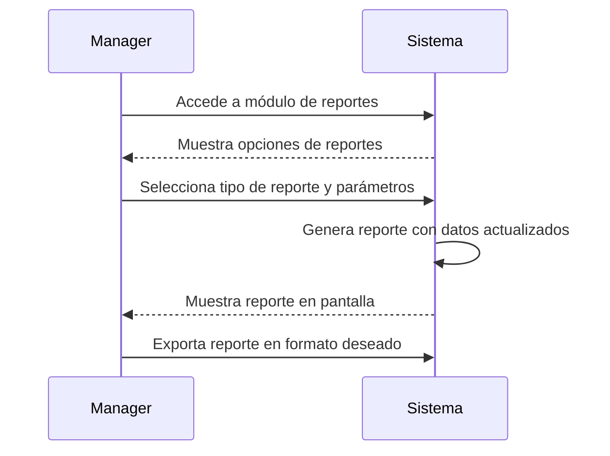
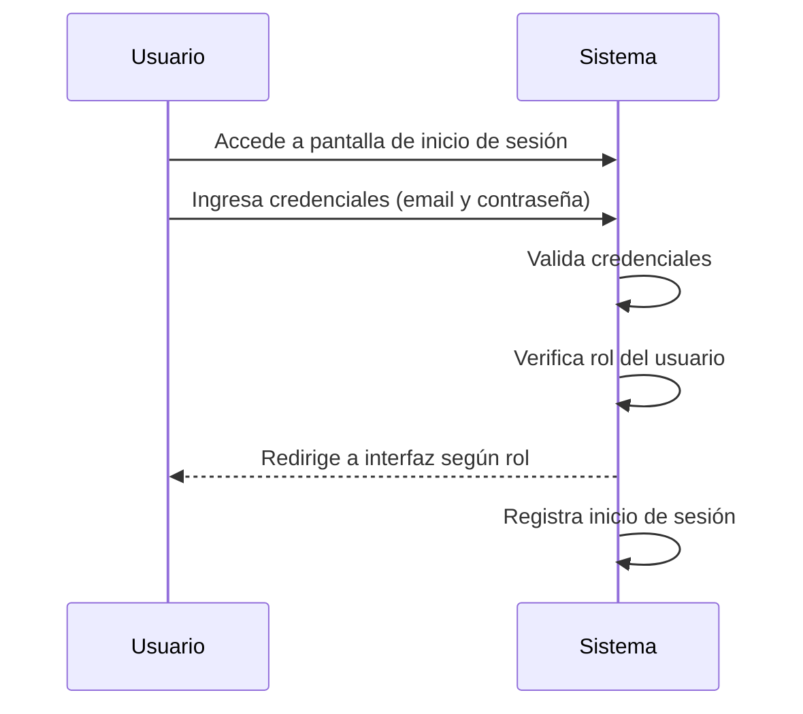
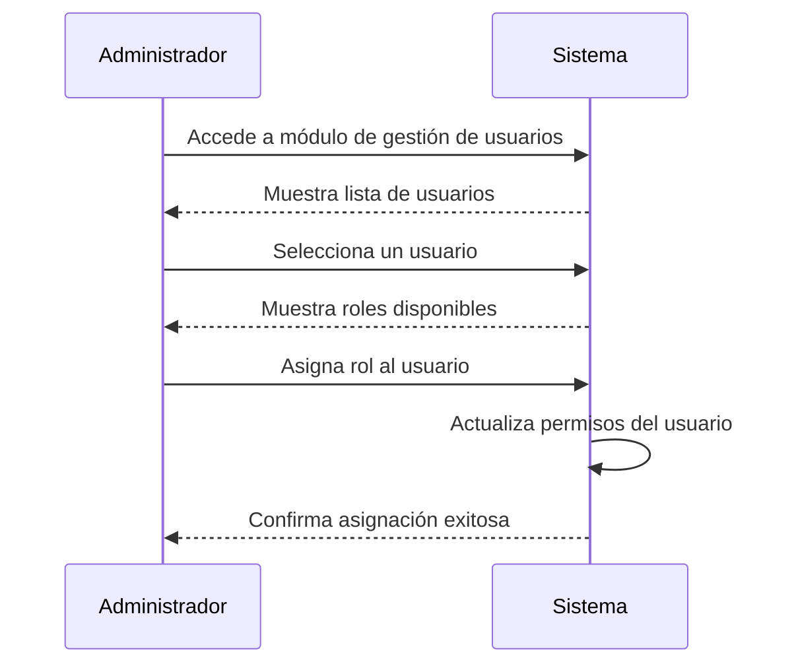
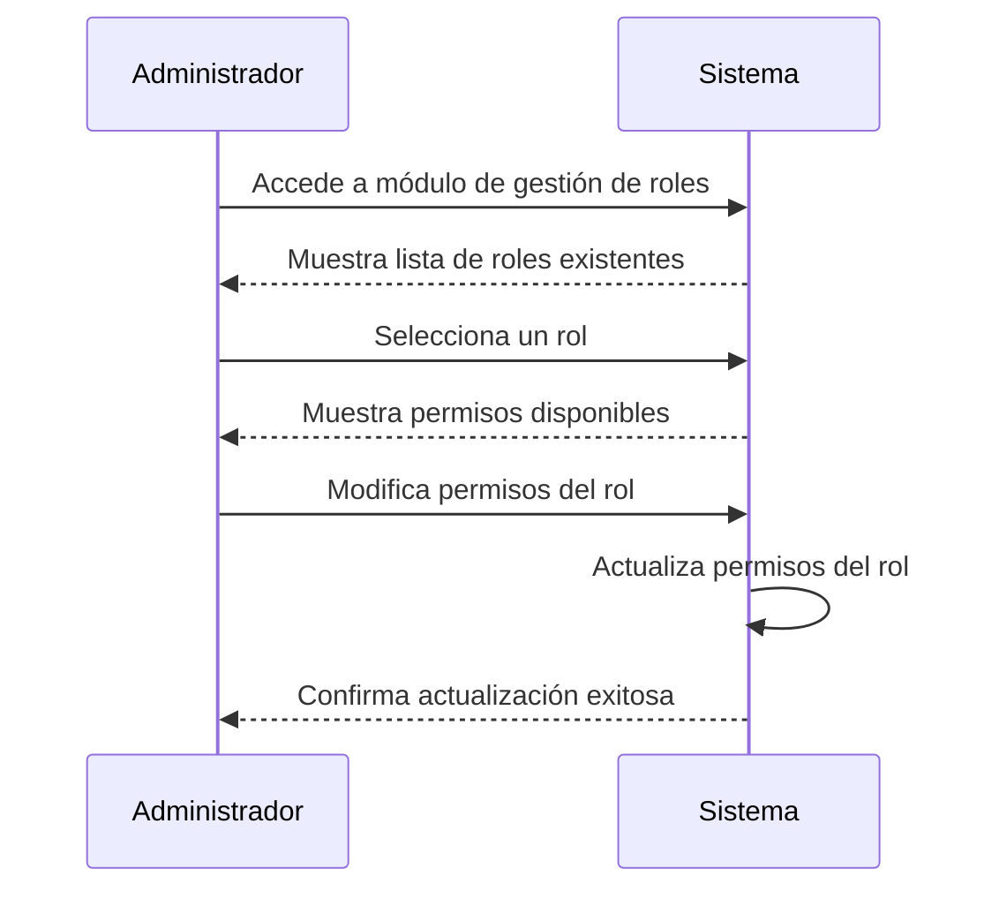
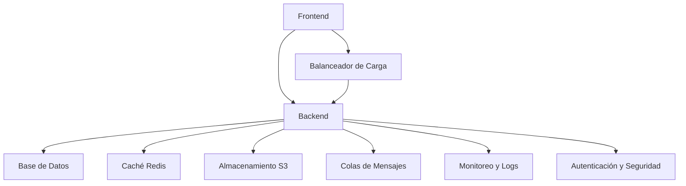
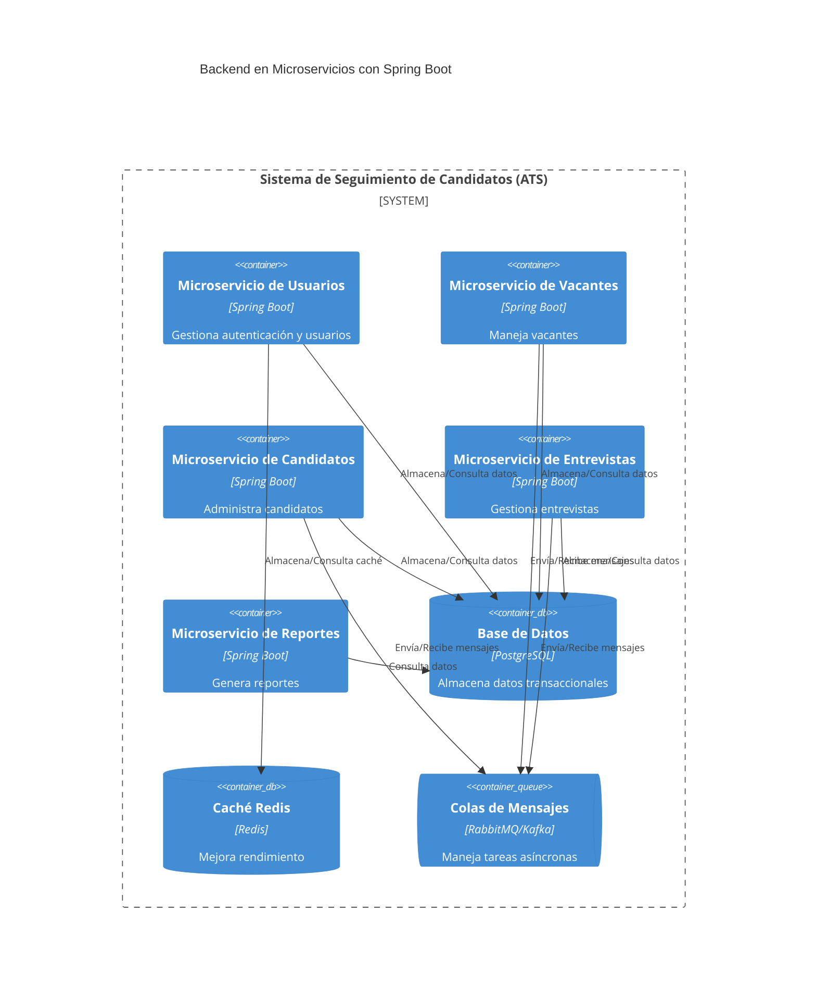

## Chatboot
Deepseek

### Solicitud

Eres un experto en producto, con experiencia en sistema de seguimiento de candidatos.

¿ Qué funcionalidades básicas tiene un sistema de seguimiento de candidatos?

Descríbemelas en un listado, ordenando por prioridad de mayor a menor.

Usando formato markdown

### Respuesta

Aquí tienes un listado de funcionalidades básicas para un sistema de seguimiento de candidatos (ATS), ordenadas por prioridad de mayor a menor:

 **Gestión de candidatos**
   - Creación y almacenamiento de perfiles de candidatos
   - Categorización y etiquetado de candidatos
   - Búsqueda y filtrado avanzado de candidatos
   - Historial de interacciones con cada candidato

2. **Publicación de vacantes**
   - Creación y edición de descripciones de puestos
   - Publicación automática en múltiples portales de empleo
   - Gestión de diferentes versiones de la misma vacante

3. **Proceso de selección**
   - Flujos de trabajo personalizables para diferentes puestos
   - Colaboración entre reclutadores y managers
   - Calificación y comentarios sobre candidatos
   - Programación de entrevistas y recordatorios
   - Integración con correo electrónico
   - Envío automatizado de emails a candidatos
   - Sincronización con la bandeja de entrada del reclutador
   - Plantillas de correo personalizables

4. **Análisis y reportes**
   - Métricas clave del proceso de contratación
   - Tiempo promedio de contratación
   - Fuentes más efectivas de candidatos
   - Diversidad de candidatos

5. **Integración con herramientas externas**
   - Portales de empleo (LinkedIn, Indeed, etc.)
   - Herramientas de videoconferencia (Zoom, Google Meet)
   - Sistemas de recursos humanos (HRIS)
   - Herramientas de evaluación técnica

6. **Automatización**
   - Asignación automática de candidatos a reclutadores
   - Recordatorios automáticos para seguimientos
   - Clasificación automática de candidatos basada en criterios

7. **Experiencia del candidato**
   - Portal de seguimiento para candidatos
   - Actualización de información personal
   - Estado del proceso de selección
   - Carga de documentos y certificados

8. **Gestión de ofertas**
   - Creación y envío de ofertas
   - Seguimiento de aceptaciones/rechazos
   - Negociación de términos
   - Integración con sistemas de nómina

9. **Cumplimiento normativo**
   - Gestión de consentimientos y privacidad
   - Registro de actividades para auditorías
   - Cumplimiento con leyes laborales locales

Estas funcionalidades forman la base de un sistema ATS moderno, y pueden ser extendidas o modificadas según las necesidades específicas de cada organización.

### Solicitud
¿ Qué beneficios obtiene un cliente al utilizar un sistema de gestión de candidatos para considerar su uso?

### Respuesta

Aquí tienes una lista de los principales beneficios que obtiene un cliente al utilizar un sistema de gestión de candidatos (ATS):
# Beneficios de un sistema de gestión de candidatos (ATS)

1. **Eficiencia en el proceso de reclutamiento**
   - Automatización de tareas repetitivas (envío de emails, programación de entrevistas)
   - Reducción del tiempo de contratación
   - Centralización de toda la información de candidatos en un solo lugar

2. **Mejora en la calidad de las contrataciones**
   - Herramientas avanzadas de filtrado y búsqueda para encontrar los candidatos más adecuados
   - Sistema de calificación y comentarios para evaluar candidatos de manera objetiva
   - Acceso al historial completo de interacciones con cada candidato

3. **Colaboración mejorada**
   - Flujos de trabajo compartidos entre reclutadores y managers
   - Comentarios y evaluaciones en tiempo real
   - Transparencia en el estado del proceso de selección

4. **Optimización de costos**
   - Reducción del tiempo invertido en procesos manuales
   - Menor dependencia de agencias de reclutamiento externas
   - Mejor aprovechamiento de los portales de empleo

5. **Mejora de la experiencia del candidato**
   - Comunicación más rápida y profesional con los candidatos
   - Portal de seguimiento para que los candidatos conozcan su estado
   - Proceso de aplicación más ágil y sencillo

6. **Cumplimiento normativo**
   - Gestión automatizada de consentimientos y privacidad
   - Registro de actividades para auditorías
   - Cumplimiento con leyes laborales locales e internacionales

7. **Análisis y toma de decisiones basada en datos**
   - Métricas clave del proceso de contratación
   - Identificación de las fuentes más efectivas de candidatos
   - Informes de diversidad y equidad

8. **Escalabilidad**
   - Capacidad para manejar un gran volumen de candidatos
   - Adaptabilidad a diferentes tipos de procesos de selección
   - Integración con otras herramientas del ecosistema HR

9. **Ventaja competitiva**
   - Procesos más ágiles que permiten captar talento antes que la competencia
   - Mejora de la imagen de marca empleadora
   - Atracción de candidatos más calificados

10. **Automatización e inteligencia artificial**
    - Clasificación automática de candidatos
    - Asistencia en la redacción de descripciones de puestos
    - Sugerencias de candidatos basadas en algoritmos de matching

Estos beneficios ayudan a las organizaciones a optimizar sus procesos de reclutamiento, mejorar la calidad de sus contrataciones y mantenerse competitivas en la atracción de talento.

### Solicitud

Revisar contra el mercado e indicarme que funcionabilidades claves podemos darle al sistema para estar poor encima de ellos?

### Respuesta

Basado en el análisis del mercado actual de ATS, aquí tienes una lista de funcionalidades clave que podrían diferenciar a LTI y posicionarlo por encima de la competencia:

# Funcionalidades diferenciadoras para un ATS competitivo

1. **Asistencia de IA avanzada**
   - Matching inteligente de candidatos basado en habilidades y cultura organizacional
   - Redacción asistida de descripciones de puestos optimizadas para SEO
   - Análisis predictivo de éxito en la contratación
   - Detección automática de sesgos en los procesos de selección

2. **Experiencia del candidato premium**
   - Portal de candidatos con diseño responsive y multiidioma
   - Proceso de aplicación en menos de 5 minutos
   - Notificaciones en tiempo real vía WhatsApp/Telegram
   - Simulador de oferta salarial y beneficios

3. **Colaboración en tiempo real**
   - Tableros Kanban compartidos para seguimiento de candidatos
   - Comentarios y evaluaciones con @menciones
   - Integración nativa con Slack/Microsoft Teams
   - Grabación y transcripción automática de entrevistas

4. **Automatización inteligente**
   - Programación automática de entrevistas con IA
   - Respuestas automáticas personalizadas a candidatos
   - Asignación dinámica de candidatos a reclutadores
   - Recordatorios contextuales basados en el comportamiento

5. **Análisis predictivo y prescriptivo**
   - Predicción de tiempo de contratación
   - Identificación de cuellos de botella en el proceso
   - Recomendaciones para mejorar la diversidad
   - Benchmarking contra estándares de la industria

6. **Integración ecosistema HR**
   - Conexión nativa con LinkedIn Recruiter
   - Integración con sistemas de nómina y HRIS
   - API abierta para desarrolladores
   - Marketplace de integraciones de terceros

7. **Movilidad y accesibilidad**
   - Aplicación móvil nativa para reclutadores
   - Acceso offline con sincronización automática
   - Soporte para múltiples husos horarios
   - Interfaz accesible (WCAG 2.1 compliant)

8. **Personalización avanzada**
   - Flujos de trabajo completamente configurables
   - Diseño de marca personalizado en todas las comunicaciones
   - Campos personalizables para diferentes tipos de roles
   - Plantillas adaptables a diferentes industrias

9. **Seguridad y cumplimiento**
   - Encriptación de extremo a extremo
   - Certificaciones ISO 27001 y SOC 2
   - Herramientas de cumplimiento GDPR/CCPA
   - Auditoría de procesos automatizada

10. **Innovación continua**
    - Programa de early access a nuevas funcionalidades
    - Feedback loop integrado con usuarios
    - Actualizaciones mensuales con mejoras
    - Comunidad de usuarios para co-creación


Estas funcionalidades, combinadas con un enfoque en experiencia de usuario, innovación tecnológica y soporte de primera clase, pueden posicionar a LTI como líder en el mercado de ATS. La clave será implementar estas características de manera intuitiva y escalable, manteniendo siempre el foco en resolver los verdaderos dolores de los reclutadores y candidatos.

### Solicitud
Genera una breve descripcion del software donde tengamos en cuenta el valor añadido y las ventajas competitivas.

### Respuesta

Aquí tienes una descripción concisa del software que resalta su valor añadido y ventajas competitivas:

# Descripción del Software: LTI ATS

**LTI ATS** es un sistema de seguimiento de candidatos de última generación diseñado para revolucionar la forma en que las empresas atraen, gestionan y contratan talento. Combinando inteligencia artificial avanzada con una interfaz intuitiva, LTI ATS ofrece una solución integral que no solo optimiza los procesos de reclutamiento, sino que también mejora significativamente la experiencia tanto de los reclutadores como de los candidatos.

## Valor Añadido:
- **Asistencia de IA predictiva**: Matching inteligente de candidatos y análisis de éxito en la contratación.
- **Automatización inteligente**: Desde la programación de entrevistas hasta respuestas personalizadas a candidatos.
- **Experiencia del candidato premium**: Portal multiidioma, notificaciones en tiempo real y proceso de aplicación ultrarrápido.
- **Colaboración en tiempo real**: Herramientas integradas para equipos de reclutamiento y managers.

## Ventajas Competitivas:
1. **Innovación continua**: Actualizaciones mensuales con nuevas funcionalidades basadas en feedback de usuarios.
2. **Integración completa**: Conexión nativa con LinkedIn Recruiter, sistemas de nómina y HRIS.
3. **Movilidad y accesibilidad**: Aplicación móvil nativa y soporte para múltiples husos horarios.
4. **Seguridad líder**: Encriptación de extremo a extremo y certificaciones ISO 27001 y SOC 2.
5. **Personalización avanzada**: Flujos de trabajo completamente configurables y diseño de marca personalizado.

Con LTI ATS, las empresas no solo optimizan sus procesos de contratación, sino que también se posicionan como empleadores de elección en el mercado competitivo de talento.

Esta descripción resalta las características clave que diferencian a LTI ATS de la competencia, enfocándose en los beneficios tangibles para los usuarios finales.

### Solicitud
Genera descripción de las funcionalidades principales del sistema de seguimientos de candidatos.

### Respuesta
Aquí tienes una descripción clara y concisa de las funcionalidades principales del sistema de seguimiento de candidatos:

# Funcionalidades Principales del Sistema de Seguimiento de Candidatos (ATS)

1. **Gestión Integral de Candidatos**
   - Creación y almacenamiento centralizado de perfiles de candidatos.
   - Búsqueda y filtrado avanzado por habilidades, experiencia y otros criterios.
   - Historial completo de interacciones con cada candidato.

2. **Publicación y Gestión de Vacantes**
   - Creación y edición de descripciones de puestos optimizadas para SEO.
   - Publicación automática en múltiples portales de empleo.
   - Gestión de diferentes versiones de la misma vacante.

3. **Proceso de Selección Eficiente**
   - Flujos de trabajo personalizables para diferentes tipos de puestos.
   - Colaboración en tiempo real entre reclutadores y managers.
   - Programación de entrevistas y recordatorios automáticos.

4. **Comunicación Automatizada**
   - Envío automatizado de emails a candidatos con plantillas personalizables.
   - Integración con correo electrónico y sincronización con la bandeja de entrada.
   - Notificaciones en tiempo real vía WhatsApp/Telegram.

5. **Análisis y Reportes**
   - Métricas clave del proceso de contratación (tiempo promedio, tasa de conversión, etc.).
   - Identificación de las fuentes más efectivas de candidatos.
   - Informes de diversidad y equidad.

6. **Integración con Herramientas Externas**
   - Conexión nativa con LinkedIn Recruiter y otros portales de empleo.
   - Integración con herramientas de videoconferencia (Zoom, Google Meet).
   - API abierta para desarrolladores y marketplace de integraciones.

7. **Experiencia del Candidato**
   - Portal de seguimiento para candidatos con actualización de información personal.
   - Estado del proceso de selección visible en tiempo real.
   - Carga de documentos y certificados de manera sencilla.

8. **Gestión de Ofertas**
   - Creación y envío de ofertas con seguimiento de aceptaciones/rechazos.
   - Negociación de términos y condiciones.
   - Integración con sistemas de nómina.

9. **Cumplimiento Normativo**
   - Gestión automatizada de consentimientos y privacidad.
   - Registro de actividades para auditorías.
   - Cumplimiento con leyes laborales locales e internacionales.

10. **Automatización e Inteligencia Artificial**
    - Clasificación automática de candidatos basada en criterios específicos.
    - Asignación dinámica de candidatos a reclutadores.
    - Detección automática de sesgos en los procesos de selección.


Estas funcionalidades están diseñadas para optimizar cada etapa del proceso de reclutamiento, desde la publicación de vacantes hasta la contratación final, ofreciendo una experiencia superior tanto para los reclutadores como para los candidatos.

### Solicitud
Genera el digrama Lean Canvas para enteder la solución a nivel de negocio en formato mermaid

### Respuesta
Aquí tienes el diagrama Lean Canvas en formato Mermaid para Markdown, que describe la solución a nivel de negocio:

```mindmap
  root((Lean Canvas))
    Problemas
      --> Procesos de reclutamiento ineficientes
      --> Falta de colaboración entre reclutadores y managers
      --> Experiencia del candidato deficiente
      --> Dificultad para cumplir normativas laborales
    Solución
      --> Sistema de seguimiento de candidatos (ATS) con IA
      --> Automatización de tareas repetitivas
      --> Colaboración en tiempo real
      --> Portal de seguimiento para candidatos
      --> Herramientas de cumplimiento normativo
    Métricas Clave
      --> Tiempo promedio de contratación
      --> Tasa de conversión de candidatos
      --> Satisfacción del reclutador y candidato
      --> Cumplimiento de normativas
    Propuesta de Valor
      --> Optimización del proceso de reclutamiento
      --> Mejora de la experiencia del candidato
      --> Cumplimiento normativo automatizado
      --> Colaboración mejorada entre equipos
    Ventaja Competitiva
      --> Asistencia de IA predictiva
      --> Integración completa con herramientas externas
      --> Actualizaciones mensuales basadas en feedback
      --> Seguridad líder en el mercado
    Canales
      --> Sitio web y blog
      --> Demostraciones en vivo
      --> Redes sociales y LinkedIn
      --> Asociaciones con empresas de HR
    Segmentos de Clientes
      --> Empresas de mediano y gran tamaño
      --> Departamentos de recursos humanos
      --> Agencias de reclutamiento
      --> Startups en crecimiento
    Estructura de Costos
      --> Desarrollo y mantenimiento del software
      --> Infraestructura cloud
      --> Soporte y atención al cliente
      --> Marketing y ventas
    Flujos de Ingresos
      --> Suscripciones mensuales/anuales
      --> Planes premium con funcionalidades avanzadas
      --> Servicios de consultoría e implementación
      --> Marketplace de integraciones
 ```
      
 Este diagrama Lean Canvas en formato Mermaid proporciona una visión general de la solución a nivel de negocio, destacando los problemas, la solución, las métricas clave, la propuesta de valor, la ventaja competitiva, los canales, los segmentos de clientes, la estructura de costos y los flujos de ingresos.     

 ### Solicitud

Como analista funcional experto genera los 3 casos de usos principales con su respectivo diagrama. Responder en formato md y los digramas en formato mermaid

 ### Respuesta
Aquí tienes los 3 casos de uso principales para un sistema de seguimiento de candidatos (ATS), junto con sus respectivos diagramas en formato Mermaid:

# Casos de Uso Principales

## 1. Publicación de Vacantes
**Descripción:** Permite a los reclutadores crear y publicar vacantes en múltiples portales de empleo.

**Actores:** Reclutador

**Flujo Principal:**
1. Reclutador inicia la creación de una nueva vacante
2. Sistema muestra formulario de creación de vacante
3. Reclutador completa los detalles del puesto
4. Reclutador selecciona portales de empleo para publicación
5. Sistema publica la vacante en los portales seleccionados
6. Sistema confirma la publicación exitosa

 ```mermaid
   sequenceDiagram
      participant Reclutador
      participant Sistema
      Reclutador->>Sistema: Inicia creación de vacante
      Sistema-->>Reclutador: Muestra formulario de creación
      Reclutador->>Sistema: Completa detalles del puesto
      Reclutador->>Sistema: Selecciona portales de empleo
      Sistema->>Sistema: Publica vacante en portales
      Sistema-->>Reclutador: Confirma publicación exitosa
 ``` 


## 2. Gestión de Candidatos
**Descripción:** Permite a los reclutadores gestionar y seguir el progreso de los candidatos en el proceso de selección.

**Actores:** Reclutador, Candidato

**Flujo Principal:**
1. Candidato aplica a una vacante
2. Sistema crea perfil del candidato
3. Reclutador revisa y califica el perfil
4. Reclutador programa entrevista
5. Sistema notifica al candidato
6. Reclutador registra feedback post-entrevista
7. Sistema actualiza el estado del candidato

 ```mermaid
sequenceDiagram
participant Candidato
participant Reclutador
participant Sistema
Candidato->>Sistema: Aplica a vacante
Sistema->>Sistema: Crea perfil del candidato
Reclutador->>Sistema: Revisa y califica perfil
Reclutador->>Sistema: Programa entrevista
Sistema->>Candidato: Notifica entrevista
Reclutador->>Sistema: Registra feedback
Sistema->>Sistema: Actualiza estado del candidato
```

## 3. Generación de Reportes
**Descripción:** Permite a los managers generar reportes analíticos sobre el proceso de reclutamiento.

**Actores:** Manager

**Flujo Principal:**
1. Manager accede al módulo de reportes
2. Sistema muestra opciones de reportes disponibles
3. Manager selecciona tipo de reporte y parámetros
4. Sistema genera reporte con datos actualizados
5. Sistema muestra reporte en pantalla
6. Manager exporta reporte en formato deseado



Estos casos de uso cubren las funcionalidades principales del sistema y sus diagramas ayudan a visualizar el flujo de interacciones entre los actores y el sistema. Cada caso de uso incluye una descripción clara, los actores involucrados y el flujo principal de eventos.

### Solicitud


### Respuesta

¡Entendido! Aquí tienes los casos de uso para la funcionalidad de ingreso a la aplicación y manejo de roles y permisos, con sus respectivos diagramas en formato Mermaid:

# Casos de Uso: Ingreso y Manejo de Roles y Permisos

## 4. Ingreso a la Aplicación
**Descripción:** Permite a los usuarios autenticarse en el sistema para acceder a las funcionalidades según su rol.

**Actores:** Usuario (Reclutador, Manager, Administrador)

**Flujo Principal:**
1. Usuario accede a la pantalla de inicio de sesión
2. Usuario ingresa credenciales (email y contraseña)
3. Sistema valida credenciales
4. Sistema verifica rol del usuario
5. Sistema redirige al usuario a la interfaz correspondiente según su rol
6. Sistema registra el inicio de sesión



## 5. Asignación de Roles
**Descripción:** Permite al administrador asignar roles a los usuarios del sistema.

**Actores:** Administrador

**Flujo Principal:**
1. Administrador accede al módulo de gestión de usuarios
2. Sistema muestra lista de usuarios
3. Administrador selecciona un usuario
4. Sistema muestra roles disponibles
5. Administrador asigna un rol al usuario
6. Sistema actualiza los permisos del usuario
7. Sistema confirma la asignación exitosa



## 6. Gestión de Permisos
**Descripción:** Permite al administrador configurar los permisos asociados a cada rol.

**Actores:** Administrador

**Flujo Principal:**
1. Administrador accede al módulo de gestión de roles
2. Sistema muestra lista de roles existentes
3. Administrador selecciona un rol
4. Sistema muestra permisos disponibles
5. Administrador modifica los permisos del rol
6. Sistema actualiza los permisos del rol
7. Sistema confirma la actualización exitosa



### Explicación:
1. **Ingreso a la Aplicación**: Cubre el proceso de autenticación y redirección según el rol del usuario.
2. **Asignación de Roles**: Permite al administrador asignar roles específicos a los usuarios.
3. **Gestión de Permisos**: Permite al administrador configurar los permisos asociados a cada rol.

Estos casos de uso son esenciales para garantizar la seguridad y el control de acceso en el sistema, asegurando que cada usuario tenga acceso solo a las funcionalidades correspondientes a su rol.


### Solicitud

Como arquitecto de software expero podemos generar el modelo entidad relacion para los 6 casos de usos que tenga los atributos con (nombre, tipo de datos) y relaciones, la salida en formato md y mermaid el diagrama

### Respuesta

¡Claro! Aquí tienes el Modelo Entidad-Relación (ER) para los 6 casos de uso, con sus atributos y relaciones, en formato Markdown y Mermaid:

# Modelo Entidad-Relación (ER)

## Entidades y Atributos

1. **Usuario**
   - `id` (UUID, PK)
   - `nombre` (String)
   - `email` (String, Unique)
   - `contraseña` (String)
   - `rol_id` (UUID, FK)

2. **Rol**
   - `id` (UUID, PK)
   - `nombre` (String, Unique)
   - `descripción` (String)

3. **Permiso**
   - `id` (UUID, PK)
   - `nombre` (String, Unique)
   - `descripción` (String)

4. **Vacante**
   - `id` (UUID, PK)
   - `título` (String)
   - `descripción` (Text)
   - `estado` (String)
   - `fecha_publicación` (DateTime)
   - `reclutador_id` (UUID, FK)

5. **Candidato**
   - `id` (UUID, PK)
   - `nombre` (String)
   - `email` (String, Unique)
   - `teléfono` (String)
   - `cv_url` (String)
   - `estado` (String)

6. **Entrevista**
   - `id` (UUID, PK)
   - `fecha` (DateTime)
   - `hora` (Time)
   - `estado` (String)
   - `candidato_id` (UUID, FK)
   - `reclutador_id` (UUID, FK)

7. **Reporte**
   - `id` (UUID, PK)
   - `tipo` (String)
   - `fecha_generación` (DateTime)
   - `manager_id` (UUID, FK)

## Relaciones

1. **Usuario-Rol**: Un usuario tiene un rol (1:1).
2. **Rol-Permiso**: Un rol tiene muchos permisos (1:N).
3. **Usuario-Vacante**: Un reclutador publica muchas vacantes (1:N).
4. **Candidato-Vacante**: Un candidato aplica a muchas vacantes (N:M).
5. **Candidato-Entrevista**: Un candidato tiene muchas entrevistas (1:N).
6. **Usuario-Entrevista**: Un reclutador programa muchas entrevistas (1:N).
7. **Usuario-Reporte**: Un manager genera muchos reportes (1:N).

```
@startuml
' Entidades
entity USUARIO {
    *id : UUID
    *nombre : String
    *email : String
    *contraseña : String
    *rol_id : UUID
}

entity ROL {
    *id : UUID
    *nombre : String
    *descripción : String
}

entity PERMISO {
    *id : UUID
    *nombre : String
    *descripción : String
}

entity VACANTE {
    *id : UUID
    *título : String
    *descripción : Text
    *estado : String
    *fecha_publicación : DateTime
    *reclutador_id : UUID
}

entity CANDIDATO {
    *id : UUID
    *nombre : String
    *email : String
    *teléfono : String
    *cv_url : String
    *estado : String
}

entity ENTREVISTA {
    *id : UUID
    *fecha : DateTime
    *hora : Time
    *estado : String
    *candidato_id : UUID
    *reclutador_id : UUID
}

entity REPORTE {
    *id : UUID
    *tipo : String
    *fecha_generación : DateTime
    *manager_id : UUID
}

' Relaciones
USUARIO ||--o{ ROL : "tiene"
ROL ||--o{ PERMISO : "tiene"
USUARIO ||--o{ VACANTE : "publica"
CANDIDATO }o--o{ VACANTE : "aplica a"
CANDIDATO ||--o{ ENTREVISTA : "tiene"
USUARIO ||--o{ ENTREVISTA : "programa"
USUARIO ||--o{ REPORTE : "genera"
@enduml
```


### Explicación del Modelo ER:
1. **Entidades**: Representan los objetos principales del sistema (Usuario, Rol, Permiso, Vacante, Candidato, Entrevista, Reporte).
2. **Atributos**: Cada entidad tiene atributos con su tipo de datos (UUID, String, Text, DateTime, etc.).
3. **Relaciones**: Conectan las entidades y describen cómo interactúan entre sí (1:1, 1:N, N:M).


### Solicitud
Como arquitecto de software expero genera el diseño ha alto nivel de sistema, con su explicación, tener en cuenta que se aun sistema confiable, transaccional y disponibildiad 24/7, generar con formato md y el diagrma en mermaid

### Respuesta
Como arquitecto de software expero genera el diseño ha alto nivel de sistema, con su explicación, tener en cuenta que se aun sistema confiable, transaccional y disponibildiad 24/7, generar con formato md y el diagrma en mermaid

# Diseño de Alto Nivel del Sistema

## Objetivos del Diseño
1. **Confiable**: Garantizar la integridad de los datos y la consistencia en las transacciones.
2. **Transaccional**: Soporte para operaciones ACID (Atomicidad, Consistencia, Aislamiento, Durabilidad).
3. **Disponibilidad 24/7**: Tolerancia a fallos y escalabilidad para garantizar la disponibilidad continua.

## Componentes Principales

1. **Frontend (Interfaz de Usuario)**
   - Aplicación web y móvil.
   - Interfaz intuitiva y responsiva.
   - Comunicación con el backend a través de APIs RESTful.

2. **Backend (Lógica de Negocio)**
   - Microservicios para cada funcionalidad (gestión de usuarios, vacantes, candidatos, etc.).
   - Autenticación y autorización basada en tokens (JWT).
   - Colas de mensajes para tareas asíncronas (ej: envío de emails).

3. **Base de Datos**
   - Base de datos relacional (PostgreSQL) para datos transaccionales.
   - Replicación maestro-esclavo para alta disponibilidad.
   - Backups automáticos y restauración rápida.

4. **Caché**
   - Redis para almacenamiento en caché de consultas frecuentes.
   - Mejora del rendimiento y reducción de la carga en la base de datos.

5. **Almacenamiento de Archivos**
   - Almacenamiento en la nube (AWS S3, Google Cloud Storage) para CVs y documentos.
   - Alta disponibilidad y escalabilidad.

6. **Colas de Mensajes**
   - RabbitMQ o Kafka para manejo de tareas asíncronas.
   - Garantía de entrega de mensajes y procesamiento en segundo plano.

7. **Monitoreo y Logs**
   - Herramientas como Prometheus y Grafana para monitoreo en tiempo real.
   - Centralización de logs con ELK Stack (Elasticsearch, Logstash, Kibana).

8. **Balanceador de Carga**
   - Nginx o AWS Elastic Load Balancer para distribuir tráfico entre instancias.
   - Escalabilidad horizontal.

9. **Autenticación y Seguridad**
   - Autenticación basada en OAuth2 y JWT.
   - Encriptación de datos en tránsito (TLS) y en reposo (AES-256).
   - Firewall y protección contra ataques DDoS.

## Diagrama de Arquitectura



## Explicación del Diseño

1. **Frontend**: Proporciona la interfaz de usuario para reclutadores, candidatos y administradores. Se comunica con el backend a través de APIs RESTful.

2. **Backend**: Contiene la lógica de negocio del sistema, dividida en microservicios para facilitar el mantenimiento y la escalabilidad.

3. **Base de Datos**: Utiliza una base de datos relacional (PostgreSQL) para garantizar la consistencia y atomicidad de las transacciones. La replicación maestro-esclavo asegura alta disponibilidad.

4. **Caché**: Redis se utiliza para almacenar en caché consultas frecuentes, reduciendo la carga en la base de datos y mejorando el rendimiento.

5. **Almacenamiento de Archivos**: Los CVs y documentos se almacenan en la nube para garantizar alta disponibilidad y escalabilidad.

6. **Colas de Mensajes**: RabbitMQ o Kafka manejan tareas asíncronas como el envío de emails, garantizando la entrega de mensajes y mejorando la eficiencia.

7. **Monitoreo y Logs**: Herramientas como Prometheus y ELK Stack permiten monitorear el sistema en tiempo real y centralizar los logs para facilitar la depuración.

8. **Balanceador de Carga**: Distribuye el tráfico entre múltiples instancias del backend, asegurando escalabilidad y alta disponibilidad.

9. **Autenticación y Seguridad**: OAuth2 y JWT garantizan la autenticación segura, mientras que la encriptación y el firewall protegen los datos y el sistema contra ataques.

## Consideraciones Adicionales
- **Escalabilidad**: El sistema está diseñado para escalar horizontalmente, añadiendo más instancias según la demanda.
- **Tolerancia a Fallos**: La replicación de la base de datos y el uso de balanceadores de carga aseguran que el sistema siga funcionando incluso en caso de fallos.
- **Backups**: Backups automáticos y frecuentes garantizan la recuperación rápida en caso de pérdida de datos.

Este diseño garantiza un sistema confiable, transaccional y con disponibilidad 24/7, listo para manejar las necesidades de un ATS moderno. ¡Espero que te sea útil! 😊

### Solicitud
Genera un diagrama C4 del componente backend en microservicios con springboot, tener presnete la salida en formato md y el diagrama en mermaid.

### Respuesta
Aquí tienes el diagrama C4 del componente backend en microservicios con Spring Boot, siguiendo el formato C4 (Context, Containers, Components) y utilizando Mermaid para el diagrama:

# Diagrama C4: Backend en Microservicios con Spring Boot

## Nivel 1: Contexto
**Sistema de Seguimiento de Candidatos (ATS)**  
El backend del sistema está compuesto por microservicios desarrollados en Spring Boot, que gestionan las diferentes funcionalidades del ATS.

## Nivel 2: Contenedores
1. **Microservicio de Usuarios**: Gestiona la autenticación, autorización y perfiles de usuarios.
2. **Microservicio de Vacantes**: Maneja la creación, publicación y gestión de vacantes.
3. **Microservicio de Candidatos**: Administra los perfiles y aplicaciones de los candidatos.
4. **Microservicio de Entrevistas**: Programa y gestiona las entrevistas.
5. **Microservicio de Reportes**: Genera reportes analíticos del proceso de reclutamiento.
6. **Base de Datos**: Almacena los datos transaccionales (PostgreSQL).
7. **Caché Redis**: Mejora el rendimiento con almacenamiento en caché.
8. **Colas de Mensajes (RabbitMQ/Kafka)**: Maneja tareas asíncronas.

## Nivel 3: Componentes (Microservicio de Usuarios como ejemplo)
1. **Controlador de Autenticación**: Maneja el inicio de sesión y la generación de tokens JWT.
2. **Controlador de Usuarios**: Gestiona la creación, actualización y eliminación de usuarios.
3. **Servicio de Autenticación**: Implementa la lógica de autenticación y autorización.
4. **Repositorio de Usuarios**: Accede a la base de datos para gestionar los datos de usuarios.

## Diagrama C4 en Mermaid


### Explicación del Diagrama C4:
1. **Nivel 1: Contexto**: Describe el sistema general (ATS) y su propósito.
2. **Nivel 2: Contenedores**: Representa los microservicios y componentes principales del backend.
3. **Nivel 3: Componentes**: Detalla los componentes internos de un microservicio (ej: Microservicio de Usuarios).
4. **Relaciones**: Muestra cómo interactúan los microservicios entre sí y con los componentes externos (BD, Redis, colas de mensajes).

### Cómo usarlo:
1. Copia el código Mermaid en un archivo Markdown (`.md`).
2. Asegúrate de que tu editor soporte Mermaid (VS Code, GitHub, etc.).
3. El diagrama se renderizará como un gráfico C4.

Este diagrama proporciona una visión clara y estructurada del backend en microservicios con Spring Boot. ¡Espero que te sea útil! 😊

