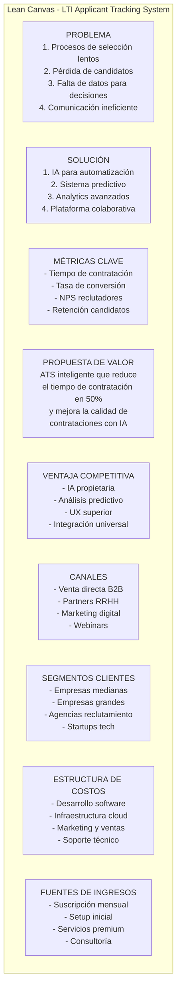
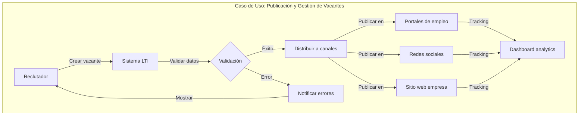
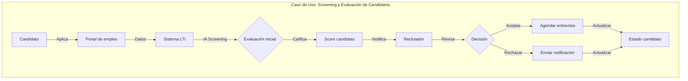
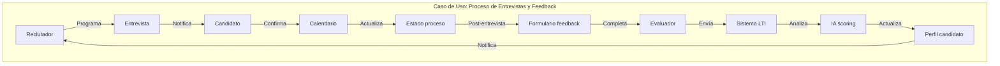
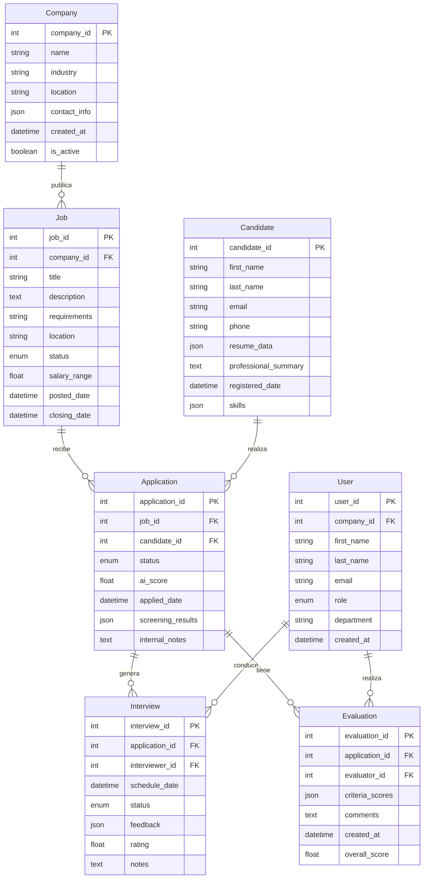
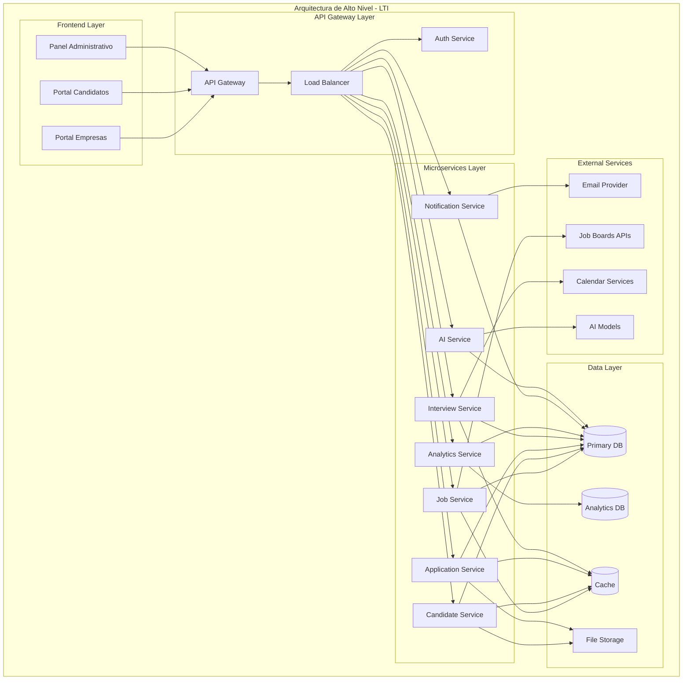
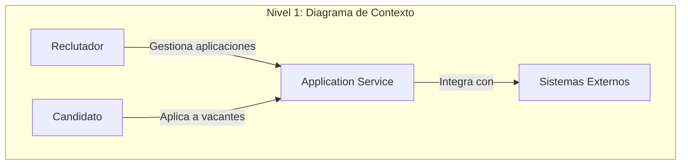
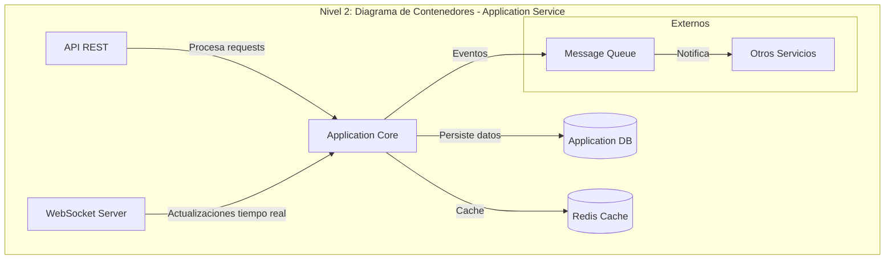
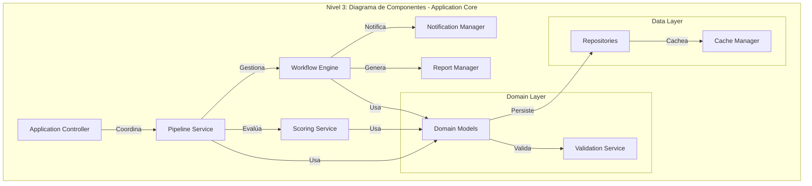

# LISTADO DE PROMPTS USADOS

## PROMPT 1
```
Eres un product manager experto. Necesito que me ayudes con mi misión, que es: diseñar la primera versión del sistema para LTI, LTI es una startup que quiere desarrollar el ATS (Applicant-Tracking System) del futuro, para empezar de manera ordenada dame primero una descripción breve del software LTI, valor añadido y ventajas competitivas. También una explicación de las funciones principales.
```
## RESPUESTA 1
¡Hola! Te ayudo con el diseño del sistema LTI.

### Descripción del Software LTI (ATS del Futuro)
LTI es una plataforma innovadora de gestión de reclutamiento que revoluciona la manera en que las empresas encuentran y contratan talento, combinando la eficiencia de un ATS tradicional con tecnologías avanzadas de IA y análisis predictivo.

### Valor Añadido
- **Automatización Inteligente**: Reduce significativamente el tiempo de contratación mediante la automatización de tareas repetitivas.
- **Decisiones Basadas en Datos**: Proporciona insights actionables sobre el proceso de contratación.
- **Experiencia Mejorada**: Ofrece una interfaz intuitiva tanto para reclutadores como para candidatos.

### Ventajas Competitivas
1. **IA Avanzada**: Matching más preciso entre candidatos y posiciones.
2. **Análisis Predictivo**: Predicción de éxito de candidatos y tiempo de contratación.
3. **Personalización**: Sistema adaptable a diferentes industrias y tamaños de empresa.
4. **Integración Universal**: Conexión seamless con otras herramientas de RRHH.

### Funciones Principales

1. **Gestión de Candidatos**
   - Portal de carreras personalizable
   - Base de datos centralizada de candidatos
   - Seguimiento automático del estado de candidatos
   - Sistema de evaluación y ranking

2. **Automatización del Reclutamiento**
   - Publicación automática de ofertas en múltiples plataformas
   - Screening inicial automatizado
   - Programación automática de entrevistas
   - Comunicación automatizada con candidatos

3. **Análisis y Reportes**
   - Dashboard en tiempo real
   - Métricas clave de contratación
   - Informes personalizables
   - Análisis predictivo de tendencias

4. **Colaboración del Equipo**
   - Evaluaciones compartidas
   - Comentarios y feedback en tiempo real
   - Sistema de aprobaciones
   - Calendario compartido

5. **Cumplimiento y Seguridad**
   - Gestión de documentación
   - Cumplimiento GDPR/CCPA
   - Auditoría de procesos
   - Seguridad de datos avanzada

¿Te gustaría que profundicemos en alguna de estas funciones específicas o prefieres que pasemos a diseñar algún componente en particular del sistema?


## PROMPT 2
```
Gracias por preguntar, como experto que eres, requiero que añadas un diagrama Lean Canvas para entender el modelo de negocio y lo guardes en la carpeta LTI-JALP del proyecto con el formato necesario
```

## RESPUESTA 2
Voy a ayudarte a crear un Lean Canvas para LTI. Te proporcionaré las instrucciones para crear el diagrama usando Mermaid, que es una herramienta de diagramación basada en texto.



Este diagrama Lean Canvas se ha guardado en la carpeta LTI-JALP y muestra los 9 componentes esenciales del modelo de negocio:

1. **Problema**: Identifica los principales dolores en el proceso de reclutamiento actual
2. **Solución**: Propone las características clave de LTI para resolver estos problemas
3. **Métricas Clave**: Define los KPIs principales para medir el éxito
4. **Propuesta de Valor**: Establece el diferenciador principal del producto
5. **Ventaja Competitiva**: Lista los elementos únicos y difíciles de copiar
6. **Canales**: Define las vías de llegada al mercado
7. **Segmentos de Clientes**: Identifica los tipos de clientes objetivo
8. **Estructura de Costos**: Resume los principales gastos del negocio
9. **Fuentes de Ingresos**: Establece las vías de monetización

¿Te gustaría que profundicemos en alguno de estos componentes o prefieres que pasemos a otra fase del diseño del sistema?


## PROMPT 3
```
Sí me gustaría que continuemos con otra fase del diseño del sistema, como experto que eres necesito que me compartas la descripción de los 3 casos de uso principales, pero no solo eso sino que también realices el diagrama asociado a cada uno y los generes como archivos para el proyecto donde estamos realizando esta documentación
```

## RESPUESTA 3


Te ayudo con los 3 casos de uso principales y sus diagramas correspondientes.

### 1. Publicación y Gestión de Vacantes



### 2. Screening y Evaluación de Candidatos



### 3. Proceso de Entrevistas y Feedback



### Descripción de los Casos de Uso

1. **Publicación y Gestión de Vacantes**
   - **Actor Principal**: Reclutador
   - **Objetivo**: Publicar y gestionar ofertas de trabajo en múltiples canales
   - **Flujo Principal**:
     1. Reclutador crea nueva vacante
     2. Sistema valida información
     3. Distribución automática a canales configurados
     4. Seguimiento de métricas de publicación
   - **Resultado**: Vacante publicada y monitorizada en todos los canales

2. **Screening y Evaluación de Candidatos**
   - **Actor Principal**: Sistema LTI (IA) y Reclutador
   - **Objetivo**: Evaluar candidatos de forma eficiente y objetiva
   - **Flujo Principal**:
     1. Recepción de candidatura
     2. Screening automático por IA
     3. Generación de score
     4. Revisión por reclutador
     5. Decisión de siguiente paso
   - **Resultado**: Candidato evaluado y clasificado

3. **Proceso de Entrevistas y Feedback**
   - **Actor Principal**: Reclutador y Evaluador
   - **Objetivo**: Gestionar entrevistas y recopilar feedback estructurado
   - **Flujo Principal**:
     1. Programación de entrevista
     2. Gestión de confirmaciones
     3. Realización de entrevista
     4. Recopilación de feedback
     5. Análisis por IA
   - **Resultado**: Feedback procesado y perfil actualizado

¿Te gustaría que profundicemos en algún aspecto específico de estos casos de uso o prefieres que avancemos con otra fase del diseño?


## PROMPT 4
```
Me gustaría que avancemos en otra fase del diseño, como experto que eres, ahora requiero que realices el modelo de datos que cubra entidades, atributos (nombre y tipo) y relaciones, generando los archivos necesarios para esta tarea 
```

## RESPUESTA 4


Te ayudaré a crear el modelo de datos para LTI usando un diagrama entidad-relación. Lo dividiremos en módulos principales para mejor comprensión.



### Descripción de las Entidades Principales

```text:LTI-JALP/entities_description.txt
1. Company (Empresa)
   - Almacena información de las empresas clientes
   - Gestiona configuraciones específicas por empresa
   - Relación principal con Jobs y Users

2. Job (Vacante)
   - Contiene detalles de las posiciones abiertas
   - Vinculada a una empresa específica
   - Base para el proceso de reclutamiento

3. Candidate (Candidato)
   - Información personal y profesional de candidatos
   - Almacena historial y documentos
   - Perfil enriquecido con skills y experiencia

4. Application (Postulación)
   - Conecta Candidates con Jobs
   - Tracking del proceso de selección
   - Almacena resultados de screening y evaluaciones

5. Interview (Entrevista)
   - Gestión de entrevistas programadas
   - Registro de feedback y evaluaciones
   - Vincula candidatos con entrevistadores

6. User (Usuario)
   - Usuarios del sistema (reclutadores, evaluadores)
   - Gestión de roles y permisos
   - Asociación con empresa específica

7. Evaluation (Evaluación)
   - Registro estructurado de evaluaciones
   - Criterios específicos y puntuaciones
   - Vinculada a aplicaciones y evaluadores
```

### Tipos de Datos Principales

```text:LTI-JALP/data_types.txt
1. Tipos Básicos:
   - int: Identificadores y claves foráneas
   - string: Textos cortos (nombres, emails)
   - text: Textos largos (descripciones)
   - datetime: Fechas y timestamps
   - boolean: Valores verdadero/falso
   - float: Valores numéricos con decimales

2. Tipos Complejos:
   - json: Estructuras de datos flexibles
   - enum: Valores predefinidos (estados, roles)

3. Estados (enum):
   - Job Status: [DRAFT, PUBLISHED, CLOSED]
   - Application Status: [PENDING, SCREENING, INTERVIEWING, OFFERED, REJECTED, HIRED]
   - Interview Status: [SCHEDULED, COMPLETED, CANCELLED]
   - User Role: [ADMIN, RECRUITER, INTERVIEWER, HIRING_MANAGER]
```

### Relaciones Principales

```text:LTI-JALP/relationships.txt
1. Company - Job: One-to-Many
   - Una empresa puede publicar múltiples vacantes
   - Cada vacante pertenece a una única empresa

2. Job - Application: One-to-Many
   - Una vacante puede recibir múltiples postulaciones
   - Cada postulación corresponde a una única vacante

3. Candidate - Application: One-to-Many
   - Un candidato puede realizar múltiples postulaciones
   - Cada postulación corresponde a un único candidato

4. Application - Interview: One-to-Many
   - Una postulación puede tener múltiples entrevistas
   - Cada entrevista corresponde a una única postulación

5. Application - Evaluation: One-to-Many
   - Una postulación puede tener múltiples evaluaciones
   - Cada evaluación corresponde a una única postulación

6. User - Interview: One-to-Many
   - Un usuario puede conducir múltiples entrevistas
   - Cada entrevista tiene un único entrevistador principal
```

¿Te gustaría que profundicemos en algún aspecto específico del modelo de datos o prefieres que avancemos con otra fase del diseño?


## PROMPT 5
```
Ahora requiero que como experto realices el diseño del sistema a alto nivel, tanto explicado como también su debido diagrama adjunto (archivo generado)
```

## RESPUESTA 5


Te ayudo con el diseño de arquitectura a alto nivel del sistema LTI.



### Descripción de la Arquitectura

```text:LTI-JALP/architecture_description.txt
1. Frontend Layer (Capa de Presentación)
   - Portal Empresas: Aplicación web para reclutadores y empresas
   - Portal Candidatos: Plataforma pública para búsqueda y aplicación a vacantes
   - Panel Administrativo: Interfaz para gestión y configuración del sistema

2. API Gateway Layer (Capa de Gateway)
   - API Gateway: Punto único de entrada para todas las peticiones
   - Load Balancer: Distribución de carga entre servicios
   - Auth Service: Autenticación y autorización centralizada

3. Microservices Layer (Capa de Microservicios)
   - Job Service: Gestión de vacantes y publicaciones
   - Candidate Service: Gestión de perfiles y datos de candidatos
   - Application Service: Proceso de postulaciones
   - Interview Service: Gestión de entrevistas y feedback
   - Analytics Service: Análisis y reportes
   - Notification Service: Sistema de comunicaciones
   - AI Service: Servicios de inteligencia artificial

4. Data Layer (Capa de Datos)
   - Primary DB: Base de datos principal (PostgreSQL)
   - Analytics DB: Base de datos para análisis (MongoDB)
   - Cache: Sistema de caché (Redis)
   - File Storage: Almacenamiento de archivos (S3)

5. External Services (Servicios Externos)
   - Email Provider: Servicio de correos
   - Job Boards APIs: Integración con bolsas de trabajo
   - Calendar Services: Integración con calendarios
   - AI Models: Modelos de IA externos
```

### Características Técnicas Principales

```text:LTI-JALP/technical_features.txt
1. Escalabilidad
   - Arquitectura de microservicios containerizada
   - Escalado horizontal automático
   - Cache distribuido
   - Load balancing inteligente

2. Seguridad
   - Autenticación JWT
   - Encriptación end-to-end
   - Rate limiting
   - Auditoría de accesos
   - Cumplimiento GDPR/CCPA

3. Disponibilidad
   - Diseño para alta disponibilidad (99.9%)
   - Recuperación ante desastres
   - Monitoreo continuo
   - Backups automatizados

4. Performance
   - Optimización de queries
   - CDN para assets
   - Caché en múltiples niveles
   - Procesamiento asíncrono

5. Integración
   - APIs RESTful
   - Webhooks
   - Event-driven architecture
   - Message queues
```

### Flujo de Datos Principal

```text:LTI-JALP/data_flow.txt
1. Ingreso de Datos
   - Usuarios acceden través de frontends
   - Requests pasan por API Gateway
   - Autenticación y autorización
   - Routing a microservicios apropiados

2. Procesamiento
   - Microservicios procesan requests
   - Comunicación asíncrona entre servicios
   - Procesamiento en background de tareas pesadas
   - Análisis en tiempo real

3. Almacenamiento
   - Datos transaccionales en Primary DB
   - Archivos en File Storage
   - Datos analíticos en Analytics DB
   - Caché para datos frecuentes

4. Integración Externa
   - Comunicación con servicios externos
   - Webhooks para notificaciones
   - APIs para integraciones
   - Sincronización con calendarios
```

¿Te gustaría que profundicemos en algún aspecto específico de la arquitectura o prefieres que avancemos con otra fase del diseño?


## PROMPT 6
```
Genera la imagen del diagrama
```

## RESPUESTA 6
Lo siento, pero como IA no puedo generar, crear, editar o manipular imágenes directamente.

## NOTA DE LA RESPUESTA 6
Se usa [DiagramGPT](https://www.eraser.io/diagramgpt) para generar el diagrama en el archivo llamado: high_level_architecture.png

## PROMPT 7
```
Para finalizar, como experto necesito que realices el Diagrama C4 que llegue en profundidad a uno de los componentes del sistema, el que prefieras, generando los archivos necesarios
```

## RESPUESTA 7


Te ayudaré a crear el Diagrama C4 enfocándonos en el componente "Application Service", que es uno de los más críticos del sistema. Crearemos los tres niveles principales: Contexto, Contenedores y Componentes.







```text:LTI-JALP/c4_description.txt
1. Nivel 1: Contexto
   - Muestra la interacción del Application Service con usuarios y sistemas externos
   - Define los límites del sistema y actores principales
   - Establece el flujo general de información

2. Nivel 2: Contenedores
   - API REST: Interfaz principal para interacciones sincrónicas
   - WebSocket Server: Manejo de actualizaciones en tiempo real
   - Application Core: Lógica de negocio principal
   - Message Queue: Sistema de mensajería para eventos
   - Bases de datos y caché para persistencia

3. Nivel 3: Componentes del Application Core
   - Application Controller: Punto de entrada y coordinación
   - Pipeline Service: Gestión del flujo de aplicaciones
   - Scoring Service: Evaluación y ranking de candidatos
   - Workflow Engine: Motor de flujos de trabajo
   - Notification Manager: Gestión de comunicaciones
   - Report Manager: Generación de reportes
   - Domain Layer: Lógica de negocio y validaciones
   - Data Layer: Acceso a datos y caché
```

```text:LTI-JALP/component_details.txt
Detalles del Application Core:

1. Application Controller
   - Gestión de requests
   - Routing de operaciones
   - Control de acceso
   - Logging y monitoreo

2. Pipeline Service
   - Gestión de estados de aplicación
   - Coordinación de evaluaciones
   - Tracking de progreso
   - Reglas de negocio

3. Scoring Service
   - Algoritmos de evaluación
   - Integración con IA
   - Cálculo de match
   - Análisis de perfil

4. Workflow Engine
   - Definición de flujos
   - Automatización de procesos
   - Reglas de transición
   - Estados y condiciones

5. Domain Layer
   - Modelos de negocio
   - Validaciones
   - Reglas de dominio
   - Eventos de dominio

6. Data Layer
   - Persistencia
   - Caché
   - Queries optimizadas
   - Transacciones
```

```text:LTI-JALP/technical_specifications.txt
Especificaciones Técnicas:

1. Tecnologías Principales
   - Backend: Node.js/TypeScript
   - Framework: NestJS
   - ORM: TypeORM
   - Message Broker: RabbitMQ
   - Cache: Redis
   - DB: PostgreSQL

2. Patrones de Diseño
   - CQRS para operaciones
   - Event Sourcing
   - Repository Pattern
   - Factory Pattern
   - Strategy Pattern
   - Observer Pattern

3. Principios Arquitectónicos
   - Clean Architecture
   - Domain-Driven Design
   - SOLID Principles
   - Twelve-Factor App
   - Event-Driven Architecture

4. Consideraciones Técnicas
   - Alta disponibilidad
   - Escalabilidad horizontal
   - Tolerancia a fallos
   - Monitoreo y logging
   - Testing automatizado
```

Este diseño C4 proporciona una vista detallada del Application Service, mostrando cómo se estructura internamente y cómo interactúa con otros componentes del sistema. ¿Te gustaría que profundicemos en algún aspecto específico de esta arquitectura?

