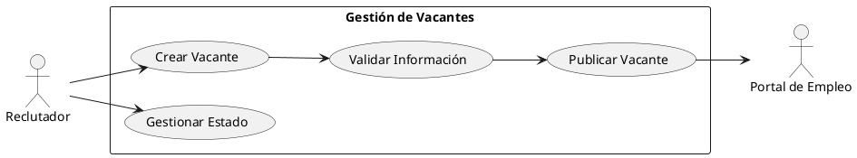
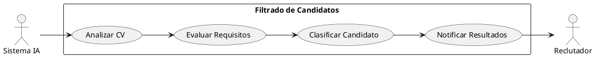
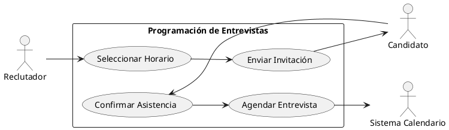
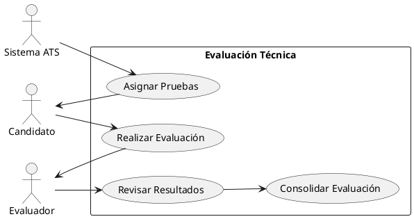
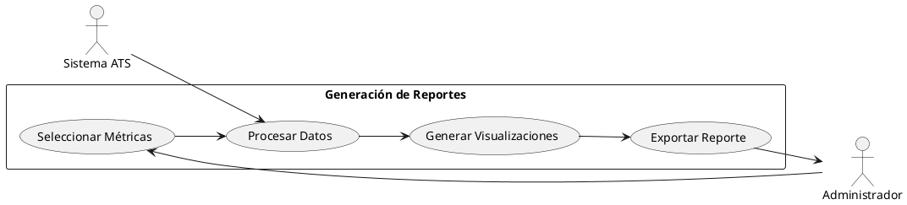
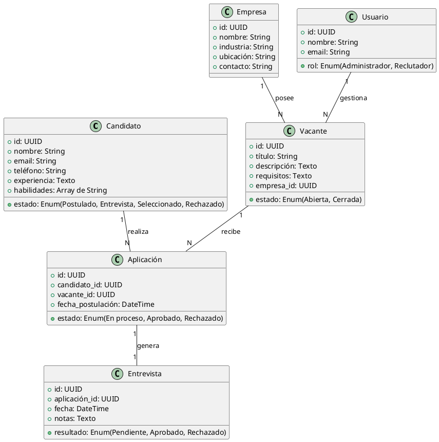

# LTI ATS - Applicant Tracking System

## Descripción breve del software LTI
LTI ATS es un sistema de gestión de candidatos diseñado para optimizar y agilizar los procesos de reclutamiento y selección de talento. La plataforma permite a las empresas gestionar postulaciones, filtrar candidatos de manera eficiente y automatizar tareas repetitivas, asegurando un flujo de contratación más ágil y efectivo.

## Valor añadido
- **Automatización del proceso de selección**: Reduce el tiempo de contratación mediante el uso de inteligencia artificial y algoritmos avanzados.
- **Mejora en la experiencia del candidato**: Ofrece una interfaz intuitiva y opciones de comunicación rápidas con los reclutadores.
- **Optimización de costos**: Disminuye la carga operativa y los costos administrativos en la gestión de procesos de selección.
- **Análisis de datos y reportes**: Brinda insights accionables para mejorar la toma de decisiones en el área de talento humano.

## Ventajas competitivas
- **Integración con plataformas externas**: Conexión con LinkedIn, portales de empleo y sistemas de recursos humanos.
- **Filtros avanzados con IA**: Evaluación de perfiles basada en competencias y experiencia para identificar a los mejores candidatos.
- **Automatización del workflow**: Configuración de procesos personalizados para cada empresa.
- **Plataforma escalable**: Diseño modular que se adapta al crecimiento de la organización.

## Explicación de las funciones principales
- **Publicación de ofertas**: Creación y difusión automática de vacantes en múltiples portales de empleo.
- **Recepción y filtrado de candidatos**: Captura de aplicaciones y preselección de perfiles mediante IA.
- **Evaluación y seguimiento**: Programación de entrevistas, pruebas psicométricas y evaluaciones técnicas.
- **Comunicación automatizada**: Envio de correos y notificaciones a candidatos y reclutadores.
- **Gestión de base de datos de talento**: Almacenamiento y segmentación de perfiles para futuras oportunidades.
- **Análisis y reportes**: Generación de informes sobre el rendimiento del proceso de selección.

## Funcionalidades básicas
- **Portal de empleos integrado**: Publicación en diversos canales de empleo.
- **Sistema de seguimiento de candidatos (ATS)**: Registro de interacciones con cada postulante.
- **Herramientas de filtrado y ranking**: Evaluación automática de compatibilidad de perfiles.
- **Automatización de respuestas y notificaciones**: Comunicaciones programadas con candidatos.
- **Gestión documental**: Almacenamiento de CVs, certificados y otros documentos relevantes.
- **Colaboración en equipo**: Asignación de tareas y comentarios entre reclutadores.
- **Reportes de desempeño**: Estadísticas sobre tiempos de contratación y calidad de los candidatos seleccionados.

## Beneficios para el cliente
- **Mayor eficiencia en la selección**: Reducción del tiempo de contratación.
- **Mejor experiencia del candidato**: Procesos más fluidos y personalizados.
- **Optimización del presupuesto de reclutamiento**: Disminución de costos operativos.
- **Mejora en la calidad de contratación**: Identificación de talento con mayor precisión.
- **Visión estratégica del reclutamiento**: Datos y reportes que facilitan la toma de decisiones.

## Alternativas a un ATS y su relevancia
- **Contratación manual**: Adecuada para pequeñas empresas con pocas vacantes.
- **Agencias de reclutamiento**: Útil cuando se busca talento especializado o internacional.
- **Portales de empleo**: Permite acceso a una gran cantidad de candidatos sin una gestión automatizada.
- **Redes sociales profesionales**: Efectivo para búsqueda proactiva de talento.
- **Referencias internas**: Opcional para empresas que priorizan contrataciones por recomendación.

## Customer Journey del Cliente
- **Identificación de necesidad**: La empresa define un nuevo puesto y requiere contratar.
- **Publicación de la vacante**: Se difunde el puesto en el ATS y portales de empleo.
- **Recepción de aplicaciones**: Se almacenan y analizan los CVs.
- **Preselección y filtros**: Se aplican pruebas automáticas y ranking de candidatos.
- **Evaluaciones y entrevistas**: Se programan y registran las interacciones.
- **Selección y oferta**: Se elige al mejor candidato y se envía la propuesta.
- **Onboarding**: Se facilita la incorporación del nuevo empleado.
- **Análisis post-contratación**: Se revisan métricas y feedback para mejorar el proceso.

# Casos de Uso Detallados - Sistema ATS

## 1. Gestión de Vacantes

### Descripción
Permite a los reclutadores crear, publicar y gestionar ofertas de trabajo en múltiples plataformas de empleo.

### Actores
- Reclutador (Actor principal)
- Sistema ATS
- Portales de empleo (Actor secundario)

### Precondiciones
- El reclutador debe estar autenticado en el sistema
- Debe existir al menos un portal de empleo configurado

### Flujo Básico
1. El reclutador selecciona "Crear nueva vacante"
2. El sistema muestra el formulario de creación
3. El reclutador ingresa:
   - Título del puesto
   - Descripción
   - Requisitos
   - Beneficios
   - Ubicación
   - Tipo de contrato
4. El reclutador selecciona los portales de publicación
5. El sistema valida la información
6. El sistema publica la vacante en los portales seleccionados
7. El sistema confirma la publicación exitosa

### Flujos Alternativos
- **FA1**: Información incompleta
  1. El sistema detecta campos requeridos sin completar
  2. Muestra mensaje de error
  3. Permite corregir la información

- **FA2**: Error en la publicación
  1. El sistema detecta error de conexión con portal
  2. Notifica al reclutador
  3. Almacena la vacante como borrador

### Postcondiciones
- Vacante publicada en los portales seleccionados
- Vacante almacenada en el sistema
- Flujo de trabajo iniciado



## 2. Filtrado de Candidatos

### Descripción
Permite evaluar y filtrar automáticamente los candidatos según los requisitos de la vacante utilizando IA.

### Actores
- Sistema ATS (Actor principal)
- Reclutador (Actor secundario)

### Precondiciones
- Existencia de candidatos postulados
- Criterios de evaluación definidos

### Flujo Básico
1. El sistema recibe una nueva postulación
2. Analiza el CV del candidato mediante IA
3. Evalúa coincidencia con requisitos
4. Asigna puntuación automática
5. Clasifica al candidato
6. Notifica al reclutador
7. Almacena resultados

### Flujos Alternativos
- **FA1**: CV en formato no compatible
  1. Sistema detecta formato inválido
  2. Notifica al candidato
  3. Solicita nuevo formato

- **FA2**: Información insuficiente
  1. Sistema detecta falta de información crítica
  2. Marca candidato para revisión manual

### Postcondiciones
- Candidatos clasificados
- Puntuaciones asignadas
- Notificaciones enviadas



## 3. Programación de Entrevistas

### Descripción
Gestiona la programación y seguimiento de entrevistas con los candidatos seleccionados.

### Actores
- Reclutador (Actor principal)
- Candidato (Actor secundario)
- Sistema de calendario (Actor secundario)

### Precondiciones
- Candidato preseleccionado
- Disponibilidad de entrevistadores registrada

### Flujo Básico
1. Reclutador selecciona candidato
2. Sistema muestra disponibilidad
3. Reclutador elige fecha y hora
4. Sistema envía invitación al candidato
5. Candidato confirma asistencia
6. Sistema agenda entrevista
7. Sistema envía recordatorios

### Flujos Alternativos
- **FA1**: Candidato rechaza horario
  1. Sistema notifica al reclutador
  2. Permite proponer nuevas fechas
  3. Reinicia proceso de coordinación

- **FA2**: Conflicto de calendario
  1. Sistema detecta superposición
  2. Sugiere horarios alternativos
  3. Permite selección de nueva fecha

### Postcondiciones
- Entrevista agendada
- Confirmaciones enviadas
- Recordatorios programados



## 4. Evaluación Técnica

### Descripción
Gestiona el proceso de evaluación técnica de los candidatos mediante pruebas automatizadas y manuales.

### Actores
- Sistema ATS (Actor principal)
- Reclutador (Actor secundario)
- Evaluador técnico (Actor secundario)
- Candidato (Actor secundario)

### Precondiciones
- Candidato aprobó entrevista inicial
- Pruebas técnicas configuradas

### Flujo Básico
1. Sistema asigna pruebas según perfil
2. Envía instrucciones al candidato
3. Candidato realiza pruebas
4. Sistema evalúa resultados automáticos
5. Evaluador revisa pruebas manuales
6. Sistema consolida resultados
7. Notifica al reclutador

### Flujos Alternativos
- **FA1**: Candidato no completa prueba
  1. Sistema detecta tiempo límite
  2. Finaliza evaluación
  3. Notifica incompletitud

- **FA2**: Fallo técnico durante prueba
  1. Sistema registra error
  2. Permite reinicio de prueba
  3. Notifica soporte técnico

### Postcondiciones
- Evaluaciones completadas
- Resultados registrados
- Siguiente fase determinada



## 5. Generación de Reportes

### Descripción
Permite generar informes y análisis sobre el proceso de reclutamiento y selección.

### Actores
- Administrador (Actor principal)
- Sistema ATS (Actor secundario)

### Precondiciones
- Datos disponibles para el período seleccionado
- Permisos de acceso configurados

### Flujo Básico
1. Administrador selecciona tipo de reporte
2. Define período de análisis
3. Selecciona métricas a incluir
4. Sistema procesa datos
5. Genera visualizaciones
6. Permite exportación
7. Almacena reporte

### Flujos Alternativos
- **FA1**: Datos insuficientes
  1. Sistema detecta falta de datos
  2. Notifica al administrador
  3. Sugiere período alternativo

- **FA2**: Error en procesamiento
  1. Sistema detecta error
  2. Registra log de error
  3. Notifica al administrador

### Postcondiciones
- Reporte generado
- Datos exportados (si se solicitó)
- Registro de generación almacenado



# Modelo de Datos

### Entidades y atributos principales

- **Candidato**
  - id (UUID, PK)
  - nombre (String)
  - email (String, único)
  - teléfono (String)
  - experiencia (Texto)
  - habilidades (Array de String)
  - estado (Enum: "Postulado", "Entrevista", "Seleccionado", "Rechazado")

- **Vacante**
  - id (UUID, PK)
  - título (String)
  - descripción (Texto)
  - requisitos (Texto)
  - empresa_id (UUID, FK)
  - estado (Enum: "Abierta", "Cerrada")

- **Empresa**
  - id (UUID, PK)
  - nombre (String)
  - industria (String)
  - ubicación (String)
  - contacto (String)

- **Aplicación**
  - id (UUID, PK)
  - candidato_id (UUID, FK)
  - vacante_id (UUID, FK)
  - fecha_postulación (DateTime)
  - estado (Enum: "En proceso", "Aprobado", "Rechazado")

- **Entrevista**
  - id (UUID, PK)
  - aplicación_id (UUID, FK)
  - fecha (DateTime)
  - notas (Texto)
  - resultado (Enum: "Pendiente", "Aprobado", "Rechazado")

- **Usuario (Reclutador)**
  - id (UUID, PK)
  - nombre (String)
  - email (String, único)
  - rol (Enum: "Administrador", "Reclutador")

### Relaciones principales
- Un **candidato** puede aplicar a múltiples **vacantes** (relación 1:N)
- Una **vacante** pertenece a una **empresa** (relación N:1)
- Una **aplicación** pertenece a un **candidato** y una **vacante** (relación N:M)
- Una **entrevista** pertenece a una **aplicación** (relación 1:1)
- Un **usuario** gestiona múltiples **vacantes** (relación 1:N)

### Diagrama


# Diseño de Alto Nivel del ATS (Applicant Tracking System)

## Arquitectura General
El ATS estará basado en una arquitectura moderna orientada a microservicios y servicios cloud, lo que permitirá escalabilidad, resiliencia y una alta disponibilidad.

El sistema se dividirá en los siguientes módulos principales:

---

### **Frontend (Web y Mobile)**
- Aplicación desarrollada en **Angular** o **React** para la web.
- Aplicación móvil desarrollada en **Flutter** o **React Native**.
- Comunicación con la capa de backend mediante **APIs REST** y **WebSockets**.

---

### **Backend (Microservicios)**
- Desplegado con una arquitectura basada en microservicios.
- Contendrá módulos independientes para cada función del ATS:
  - Gestión de Candidatos
  - Gestión de Vacantes
  - Proceso de Selección
  - Gestión de Entrevistas
  - Notificaciones y Comunicaciones
- Implementado con **Spring Boot** y **Node.js**.

---

### **Base de Datos**
- **PostgreSQL** para almacenamiento transaccional.
- **Elasticsearch** para búsquedas eficientes.
- **Redis** para caché y mejorar la respuesta.

---

### **Servicios Externos**
- Integración con **LinkedIn** y otras plataformas de reclutamiento.
- Servicios de envío de correos (**SendGrid**, **AWS SES**).
- Autenticación con **OAuth 2.0** / **OpenID Connect**.

---

### **Infraestructura y Despliegue**
- Orquestado con **Kubernetes**.
- Monitorización con **Prometheus** y **Grafana**.
- Despliegue automatizado con **CI/CD** en **GitHub Actions** o **Jenkins**.


# Diagrama C4 - Gestión de Candidatos

### **Contexto (Nivel 1)**
El sistema ATS permite a los reclutadores gestionar candidatos a través de una aplicación web y móvil. Los candidatos pueden aplicar a vacantes y recibir notificaciones sobre su estado en el proceso de selección.

```
[Persona] --> (ATS)
(ATS) --> [LinkedIn API]
(ATS) --> [Email Service]
(ATS) --> [OAuth 2.0]
```

### **Contenedores (Nivel 2)**
El microservicio de gestión de candidatos interactúa con la base de datos, servicios externos y el frontend.

```
[Frontend] --> (Candidate Service)
(Candidate Service) --> [PostgreSQL]
(Candidate Service) --> [Redis]
(Candidate Service) --> [LinkedIn API]
(Candidate Service) --> [Email Service]
```

### **Componentes (Nivel 3)**
Descomposición del microservicio en módulos internos.

```
(Candidate Service) --> (Controller Layer)
(Candidate Service) --> (Service Layer)
(Candidate Service) --> (Repository Layer)
(Candidate Service) --> (Integration Layer)
```

### **Código (Nivel 4)**
Ejemplo de implementación de un endpoint en Spring Boot.

```java
@RestController
@RequestMapping("/candidates")
public class CandidateController {

    @Autowired
    private CandidateService candidateService;

    @GetMapping("/{id}")
    public ResponseEntity<Candidate> getCandidate(@PathVariable Long id) {
        return ResponseEntity.ok(candidateService.findById(id));
    }
}
